# Project 1 on Linux Commands

## Linux is a family of open-source Unix operating systems based on the Linux Kernel.

## Linux Command is a program or utility that runs on the CLI- a console that interacts with the system via texts and processes. 

### Attached below are the screenshots of my workspace on Ubuntu

`sudo apt update`

`pwd`

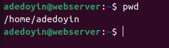

`cp`, `cat` , `tac`

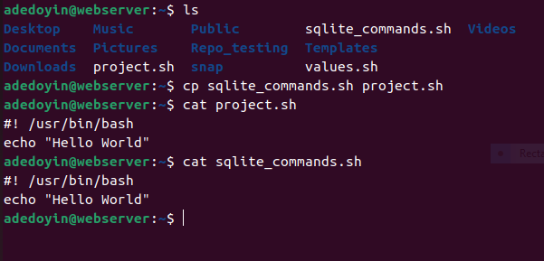

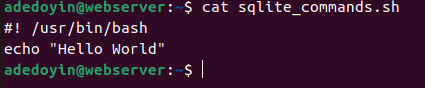

  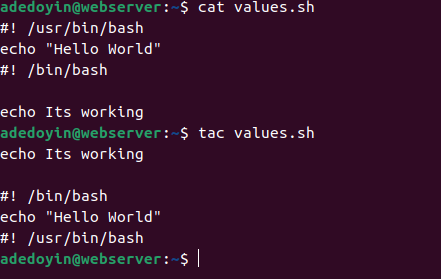

`code`
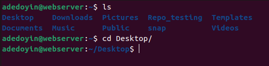 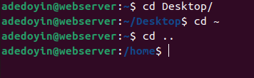

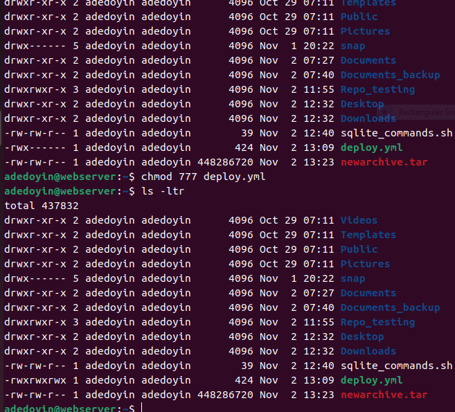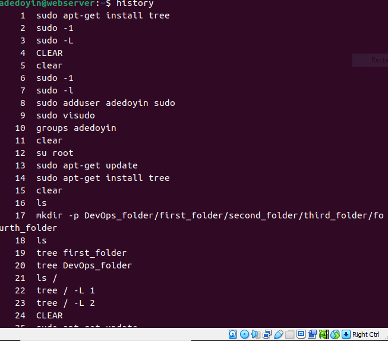

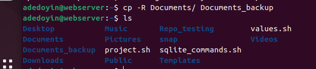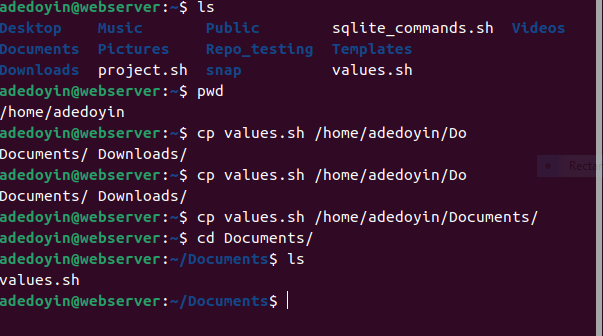

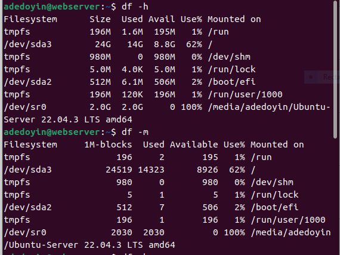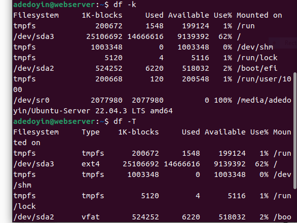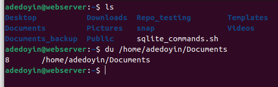

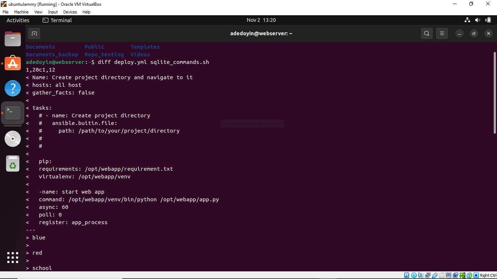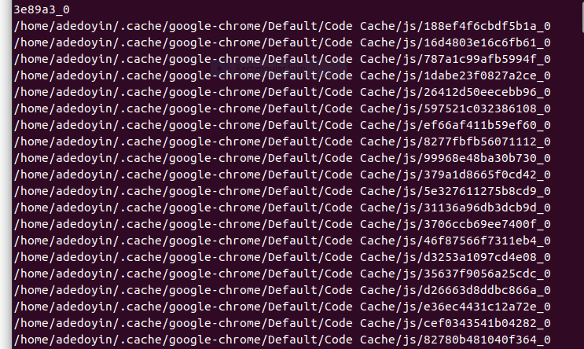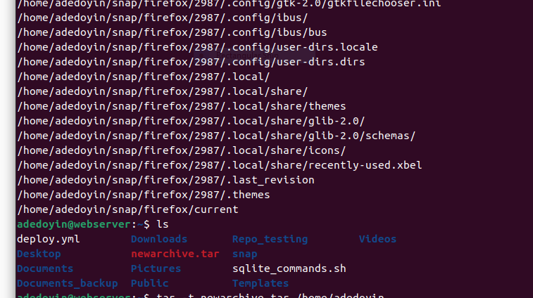

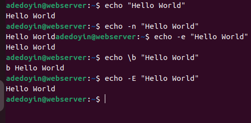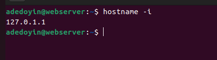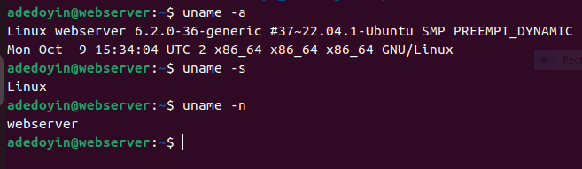

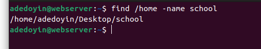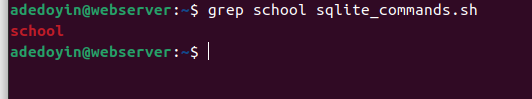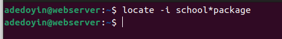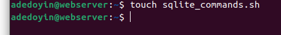

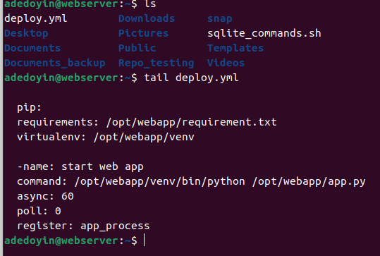

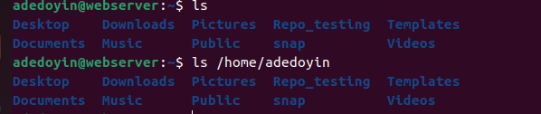

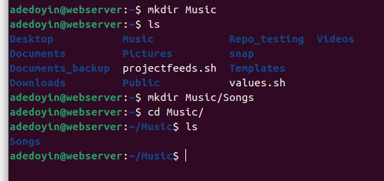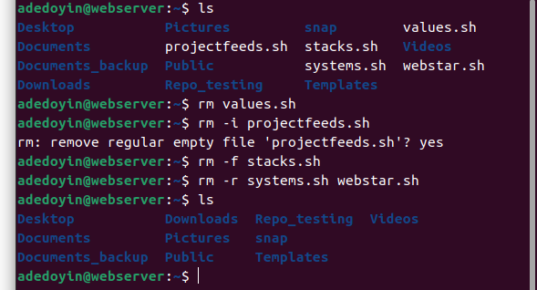

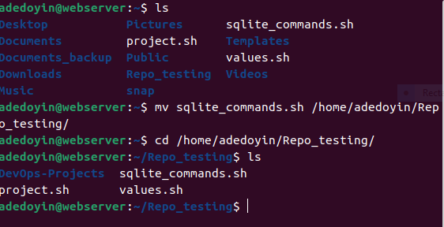

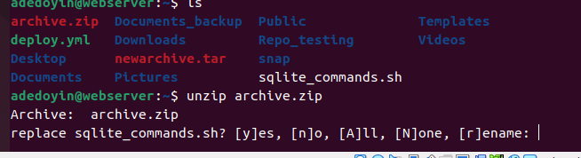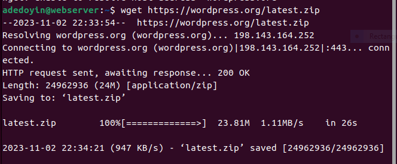
