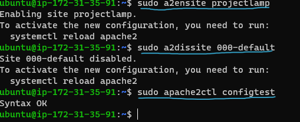

### LAMP STACK IMPLEMENTATION PROJECT
This Project (LAMP STACK) is a comprehensive program designed for individuals seeking to build and deploy web applications using LAMP stack, which stands for:
- Linux
- Apache
- MySQL
- PHP
In this project I will show how to set up a Linux environment, configure the Apache web server, manage MySQL databases and write PHP code for server-side functionality.

## WEB STACK IMPEMENTATION (LAMPSTACK) IN AWS

The are different stacks of technologies that a DevOps engineer uses as the tool of work implementation. These stack of technology is regarded as **WEBSTACKS** And the examples are
- LAMP(Linux,Apache,MySQL,PHP)
- LEMP(Linux, Nginx,MySQL,PHP or Python or Perl)
- MERN(MongoDB,ExpressJS,ReactJS,NodeJS)
- MEAN(MongoDB, ExpressJS, AngularJS,NodeJS)

### PREPARATION PREREQUISITES
An AWS Account is of necessity for the provisioning of an Ubuntu-22.04 server. While creating the server, ensure you create a Pem Key pair and download it as this will be used to connect to the EC2 instance following the below steps;

1. Register an AWS free tier account
2. Setup the account with a preferred region, selecting the closest yo your country
3. Launch a new EC2 instance of t2.micro family with Ubuntu-22.04 LTS(HVM)
4. Save your private key(.PEM) in a folder on your workstation
5. Download a window terminal [here](https://apps.microsoft.com/detail/9N0DX20HK701?activetab=pivot%3Aoverviewtab&hl=en-us&gl=US)
6. Change directory to the folder where the .pem file is and connect to the instance by running the command below

### Installing Apache and Updating the Firewall

Apache is an open source web server software. It is among the most popular web servers. It runs on 67% of all webservers in the world, It is fast, reliable and secure.

Install Apache using Ubuntu's package manager `apt`

To install anything on the terminal, its advisable to update the list of package in the package manager with 

> sudo apt update

Once update is completed, go ahead and install the Apache.

> sudo apt install apache2

and verify that it installed correctly by running 

> sudo systemctl status apache2

If it is green and running, then you did everything correctly

Before we can receive any traffic by our Web Server, we need to open TCP port 80 which is the default port that web browsers use to access web pages on the internet. This enables us access the running server locally on our Ubuntu shell

To check how if we can access it locally on Ubuntu shell, run

> $ curl http://localhost:80
or 
> curl http://127.0.0.1:80

Now to test how Apache HTTP server can respond to requests from internet. Open a web browser to access this url 
`http://<Public-IP-Address>:80`

And you should get the output below

### Installing MySQL

A database Management System needs to be installed for storage and management of data on the running site in a relational database. MySQL is the popular relational database management system used withing PHP environment.

To install MySQL

> $ sudo apt install mysql-server

confirm with a `Y` and enter

Then go ahead and log in to MySQL console 

> sudo mysql

This should connect you as the administrative database user **root**

It is recommended to run a pre-installed security script with MySQL. This will lock access to the database and remove insecure default settings that came with the installations. 
Before running the script, a password for root user needs to be set as default authentication using **mysql_native_password**. I defined `PassWord.1` as the user's password ( You can use any password of your own)

> ALTER USER 'root'@'localhost' IDENTIFIED WITH mysql_native_password BY 'PassWord.1';

Once this is set, exit the MySQL shell

**Start interactive script by running:**

> $ sudo my_sql_secure_unstallation

It will ask if you want to configure the VALIDATION PASSWORD PLUGIN, go ahead (note that enabling this feature is a judgement call, and if enabled, passwords which do not match the specified criteria will be rejected by MySQL with an error), so it is safe to leave it as disabled but use strong and unique passwords.
Once you select Y(yes) you will asked to select a level of password validation.(Selecting 2 means strongest level as you will get errors when password does not contain numbers, upper and lowercases letters, and special characters).

Note that this password asked is the **MySQL root user** as the first password set is the **database root User password**. You will be shown the password strength that you just entered if password validation is enabled and if you happy with the password enter Y for yes at the prompt.

For the rest of questions press Y and hit Enter at each prompt.This will prompt you to change root password, remove some anonymous users and test database, disable remote root logins and load these new rules so that MySQL immediately respects the changes made.

Once you finish, test if you are able to log in to MySQL concole with:

> $ sudo mysql -p

Notice the `-p` flag in the command, will prompt for the password used after changing the root user password

Then you log out with:

>$ mysql> exit

### Installing PHP

PHP is the component of our setup that will process code to display dynamic content to the end user. For the PHP package, we will need the php-mysql module that allows PHP to comummunicate with MySQL-based databases. We also need libapache2-mod-php to enable Apache handle PHP files. Core PHP packages will be installed as dependencies.

To install these 3 packages at once, run:

> sudo apt install php libapache2-mod-php php-mysql

Confirm PHP version after installation

> php -v

At this point LAMP (Linux(Ubuntu), Apache HTTP Server, MySQL, PHP) has completely been installed and fully opertional. Next is to test your setup with PHP script, which is best setup with a proper **Apache Virtual Host** to hold the website's files and folders.

### Enable PHP on the website

With the default DirectoryIndex, settings on Apache, a file named `index.html` will always take precedence over an `index.php` file. This is useful for setting up maintenance pages in PHP applications, by creating a temporary `index.html` file containing an informative message to visitors. The `index.html` is renamed or removed from the document root, bringing back the regular application page, once the maintenance is over.

When the need to change this behavior, you will edit the */etc/apache2/mods-enabled/dir.conf* file and change the order in which the *index.php* file is listed within the **Directoryindex** directive.

> sudo vim /etc/apache2/mods-enabled/dir.conf

 which will open the editor

 Then we change the DirectoryIndex to

 After saving and closing the editor, we will reload Apache so that the changes take effect:

 > $ sudo systemctl reload apache2

 

 Finally, we will create a PHP script to test that PHP is working perfectly on the server.

 Create a new file named `index.php` inside your custom web root folder:

 > sudo vim /var/www/html/index.php

 This will open a blank file. Then we add a valid PHP code inside the file 
    
    <?php
    phpinfo();

 

The output on a browser should look like this:

After confirmation, it is safe to remove the file as it contains sensitive information about your PHP environment and Ubuntu Server running the below command.

> 

### Creating a Virtual Host for your Website using Apache

I will be setting up a domain called `projectlamp`, which can be any name of your choice.
Apache on ubuntu 22.04 has a server block enabled by default that is configured to serve documents from the /var/www/html directory and I will be leaving this configuration as is and create another directory next to the default one.

Create a directory for `projectlamp`

Next, assign ownership of the directory with the `$USER` environment variable, which will reference your current system user:

> $ sudo chown -R $USER:$USER /var/www/projectlamp

 

Then, create and open a new configuration file in Apache's `sites-available` directory using vim editor

>$ sudo vi /etc/apache2/sites-available/projectlamp.conf

which will create a new blank file and paste the following bare-bones configuration inside the empty text document.

    <VirtualHost *:80>
        ServerName projectlamp
        ServerAlias www.projectlamp
        ServerAdmin webmaster@localhost
        DocumentRoot /var/www/projectlamp
        ErrorLog ${APACHE_LOG_DIR}/error.log
        CustomLog ${APACHE_LOG_DIR}/access.log combined
    <VirtualHost>

To save and close, follow the below steps;

- Hit the `esc` button on the Keyboard
- Type `:`
- Type `wq` . w for `write` and q for `quit`.
- Hit `ENTER` to save file.

To show the new file in the **sites-available** directory, use the code below:

> $ sudo ls /etc/apache2/sites-available

Note: with this VirtualHost configuration, is telling Apache to serve projectlamp using /var/www/projectlamp as its root directory. If you want the Apache server to test without Domain name, /comment the options serverName and Server Alias by adding # in the beginning of each option's lines to tell the program to skip processing those lines.

Now you can use *a2ensite* command to enable the new virtual host

> $ sudo a2ensite projectlamp

Then you can also disable the default website that comes installed with Apache. 

> $ sudo a2dissite 000-default

And to make sure your configuration doesnt contain syntax errors, run:
>$ sudo apache2ctl configtest

Finally, reload Apache so these changes take effect:
> $ sudo systemctl reload apache2

Your new website is now active but /var/www/projectlamp is still empty. Create an index.html file in that location so that you can test the Virtual host works as expected.

>sudo echo 'Hello LAMP from hostname' $(curl -s http://169.254.169.254/latest/meta-data/public-hostname) 'with public IP' $(curl -s http://169.254.169.254/latest/meta-data/public-ipv4) > /var/www/projectlamp/index.html

Now go to your browser and try to open your website URL using IP address:

`http://<Public-IP-Address>:80`

If you see the text from the 'echo' command written to the html file, then the Virtual Host is working well. You should see your server's publicn hostname(DNS name) and Public Ip address.
 
You can also access Website on your browser by public DMS name.

`http://<Public-DNS-Name>:80`
