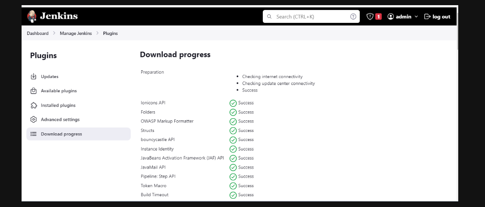
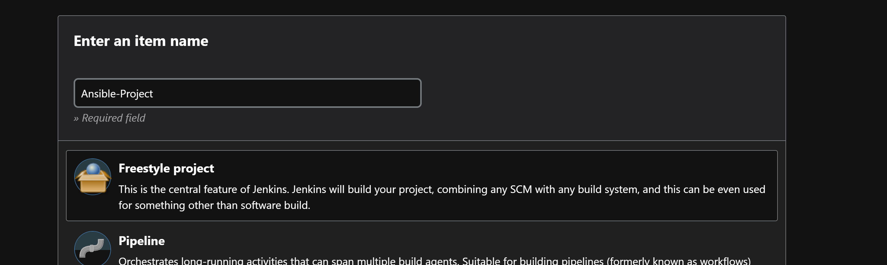
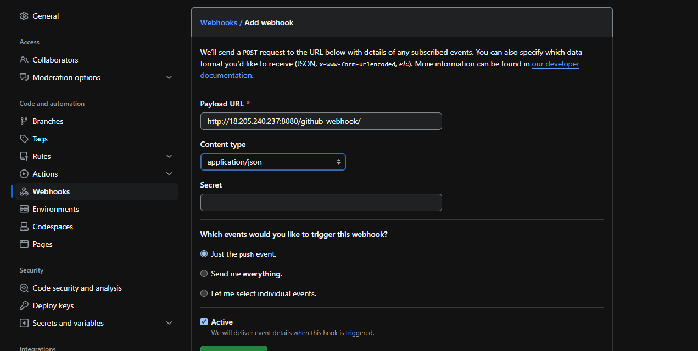
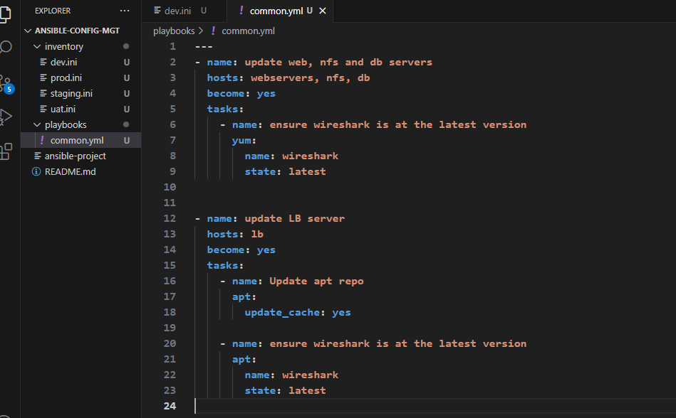

# An Introduction to Ansible

## What is Ansible?

Ansible is a simple, open-source IT automation platform that helps you automate tasks like application deployment, configuration management, and cloud provisioning. It's agentless, meaning it doesn't require any software to be installed on the machines you want to manage.

Ansible is at the forefront of automation, systems administration, and DevOps.

- It simplifies and automate IT tasks
- Reduce errors
- Improve efficiency
- Increase agility
- Open source

### Ansible Client as a Jump Server (Bastion Host)
A Jump Server (sometimes also referred as `Bastion` Host) is an intermediary server through which access to internal network can be provided. If you think about the current architecture you are working on, ideally, the webservers would be inside a secured network which cannot be reached directly from the Internet. That means, even DevOps engineers cannot SSH into the Web servers directly and can only access it through a Jump Server - it provides better security and reduces attack surface.

On the diagram below the Virtual Private Network (VPC) is divided into two subnets - Public subnet has public IP addresses and Private subnet is only reachable by private IP addresses.

In previous projects we had to perform lots of manual operations to set up virtual servers, install and configure required software and deploy our web applications especially on projects 7 through 10. This project however, will make us appreciate DevOps tools more by making the most of the routine tasks automated with  [Ansible Configuration Management](https://www.digitalocean.com/community/conceptual-articles/an-introduction-to-configuration-management-with-ansible), at the same time building confidence in writing code using declarative languages such as [YAML](https://en.wikipedia.org/wiki/YAML)

In this project,  We will be installing and configuring Ansible client as a Jump Server/Bastion Host and create a simple Ansible Playbook[Playbook](https://docs.ansible.com/ansible/latest/playbook_guide/playbooks_intro.html) to automate servers configuration.

#### Step 1
## Install and Configure Ansible on EC2 Instance

1. Update the name tag on your last projects Jenkins EC2 Instance to `Jenkina-Ansible`. or Launch a new instance.
We will use the server to run playbooks.

2. In your github account create a new repository and name it `ansible-config-mgt`

3. SSH into ubuntu and Install Ansible 

>       sudo apt update
>       sudo apt install ansible

Check your ansible version running `ansible --version`

>        ansible --version

4. ## INSTALL AND CONFIGURE JENKINS

- Install Jenkins and check status

**NOTE** I already had Jenkins installed. So the command used in this screenshot is not enough for a fresh install. For fresh install use the below command. This is the Debian package repository of Jenkins to automate installation and upgrade. 

>          sudo wget -O /usr/share/keyrings/jenkins-keyring.asc \
>         https://pkg.jenkins.io/debian-stable/jenkins.io-2023.key
>         echo deb [signed-by=/usr/share/keyrings/jenkins-keyring.asc] \
>         https://pkg.jenkins.io/debian-stable binary/ | sudo tee \
>         /etc/apt/sources.list.d/jenkins.list > /dev/null
>         sudo apt update
>         sudo apt install jenkins    

>           sudo systemctl status jenkins

- Jenkins use port 8080 for connection. Open the port in your EC2 instance

- Unlock jenkins with the password you copied with the provided path in `Unlock Jenkins` page

- Set up Jenkins, install plugins, create user etc

- Create a new Freestyle project ansible in Jenkins and point it to your ‘ansible-config-mgt’ repository.

Point Jenkins to the ``main` branch

- Configure a Post-build job to save all [ `**`] files, like it was done in past Project.

- Configure Webhook in GitHub and set webhook to trigger ansible build.

5. Test your setup by making some change in README.md file in `main` branch and make sure that builds starts automatically and Jenkins saves the files (build artifacts) in following folder

>       ls /var/lib/jenkins/jobs/ansible/builds/<build_number>/archive/

#### Step 2: 
## Prepare the Development Environment using Visual Studio Code

The `Dev` in DevOps means you will be required to write some codes and should have proper tools to make your coding and debugging comfortable. You need an ***Integrated Development Environment (IDE)***. I will be using `Visual Studio Code (VSC)`. It is free and versatile and will fully satisfy your development needs. You can download this amazing and powerful development tool by clicking right [Here](https://code.visualstudio.com/download).

After installing visual studio code, configure it to connect to your newly created GitHub repository.

Clone down your ansible-config-mgt repo to your Jenkins-Ansible instance
>           git clone <ansible-config-mgt repo link>

#### Step 3: 
## Begin Ansible Development

1. In the `ansible-config-mgt` GitHub repository, create a new branch that will be used for development of a new feature.'

>       git branch new_feature  
This will only create the new branch and switch with the next command:
>       git switch new_feature

>       git checkout -b new_feature
This will create and switch to new branch

2. Checkout the newly created feature branch to your local machine and start building your code and directory structure.

3. Create a directory named playbooks. It will be used to store all your playbook files. >  
>           mkdir playbooks

4. Create a directory named inventory. It will be used to keep your hosts organised. mkdir inventory
>           mkdir inventory

5. Within the playbooks folder, create your first playbook and name it common.yml

>           cd playbooks
>           touch common.yml

6. Within the inventory folder, create an inventory file for each environment (Development, Staging, Testing and Production) named `dev`, `staging`, `uat` and `prod` respectively. These files use `.ini` languages style to configure Ansible hosts.

>           touch dev.yml staging.yml uat.yml prod.yml

#### Step 4: 
## Set up an Ansible Inventory

An Ansible inventory file defines the hosts and groups of hosts upon which commands, modules, and tasks in a playbook operate. Since our intention is to execute Linux commands on remote hosts, and ensure that it is the intended configuration on a particular server that occurs. It is important to have a way to organize our hosts in such an Inventory.

1. Save the below inventory structure in the `inventory/dev` file to start configuring your development servers. Ensure to replace the IP addresses according to your own setup.

>           [nfs]
>           <NFS-Server-Private-IP-Address>  ansible_ssh_user=ec2-user
>
>           [webservers]
>           <Web-Server1-Private-IP-Address> ansible_ssh_user=ec2-user
>           <Web-Server2-Private-IP-Address> ansible_ssh_user=ec2-user
>
>           [db]
>           <Database-Private-IP-Address> ansible_ssh_user=ec2-user 
>
>           [lb]
>           <Load-Balancer-Private-IP-Address> ansible_ssh_user=ubuntu

Note: Ansible uses TCP port 22 by default, which means it needs to `ssh` into target servers from `Jenkins-Ansible` host. For this we can implement the concept of `ssh-agent`. Now you need to import key into `ssh-agent`

>           eval `ssh-agent -s`
>           ssh-add -k <path-to-private-key>

2. Confirm the key has been added with the command `ssh-add -l`

>           ssh-add -l 

3. ssh into the Jenkins-Ansible server using ssh-agent ssh -A ubuntu@public-ip

>           ssh -A ubuntu@public-ip

4. Update the `inventory/dev.yml` file by inputting the IP addresses and usernames of the respective servers you provisioned in AWS.

**As you can see we will need to launch 5 servers (1 Ubuntu and 4 RHEL servers)**

#### Step 5:
## Create a Common Playbook

It is time to begin giving Ansible the instructions on what you need to be performed on all servers listed in `inventory/dev`.

1. In `common.yml` playbook you will write configuration for repeatable, re-usable and multi-machine tasks that is common to systems within the infrastructure.

2. Update the `playbooks/common.yml` file with the commands below

    

        ---
        - name: update web, nfs and db servers
          hosts: webservers, nfs, db
          become: yes
          tasks:
           - name: ensure wireshark is at the latest version
             yum:
               name: wireshark
               state: latest

        - name: update LB server
          hosts: lb
          become: yes
          tasks:
            - name: Update apt repo
              apt: 
               update_cache: yes

        - name: ensure wireshark is at the latest version
          apt:
            name: wireshark
            state: latest

       

The playbook is divided into two parts, each of them is intended to perform the same task: install wireshark utility (or make sure it is updated to the latest version) on your RHEL 8 and Ubuntu servers. It uses root user to perform this task and respective package manager: yum for RHEL 8 and apt for Ubuntu.

Feel free to update this playbook with the following tasks:

Create a directory and a file inside it
Change timezone on all servers
Run some shell script

#### Step 6: 
## Update Git with the Latest Code

Now all of the directories and files live on your local machine and you need to push changes made locally to GitHub. In the real world, you will be working within a team of other DevOps engineers and developers. It is important to learn how to collaborate with the help of `Git`.

In many organizations, there is a development rule that does not allow the deployment of any code until it has been reviewed by an extra pair of eyes - It is called the ***Four-Eyes Principle***.

Now you have a separate branch, you will need to know how to raise a Pull Request (PR), get your branch peer reviewed and

1. Use the git command to add and push to github

>       git status
>       git add <selected files>
>       git commit -m "commit message"

2. Create a Pull Request (PR)

3. Wear the hat of another developer for a second, and act as a reviewer.

4. If the reviewer is happy with your new feature development, merge the code to the main branch.

5. Head back to your terminal, checkout from the feature branch into the main, and pull down the latest changes.

>               git switch main
OR
>               git checkout main

Once your code changes in master branch, Jenkins will do its job and save all the files (build artifacts) to /var/lib/jenkins/jobs/ansible/builds/<build_number>/archive/ directory on Jenkins-Ansible server.

#### Step 7: 
## Run first Ansible test

Now it is time to execute ansible-playbook command and verify the playbook actually works.

1. Clone the repo into the ubuntu server

>           cd ansible-config-mgt

>           ansible-playbook -i inventory/dev.yml playbooks/common.yml

We can see from the screenshots below that the playbook ran successfully. 

Successful connections were made to all servers and changes (installing and updating wireshark) were made. We can login and confirm this from all 4 servers.

Check each of the servers and confirm `wireshark` has been installed using the command

>           which wireshark 
or
>           wireshark --version

`db Server`

`nfs Server`

`web1 Server`

`web2 Server`

**It is seen from the above screenshots that ansible is able to connect to the remote servers and execute the playbook successfully**

The Ansible Architecture below shows the picture of all we did.

Congratulations!! You have just automated your routine tasks by implementing your first Ansible project!

