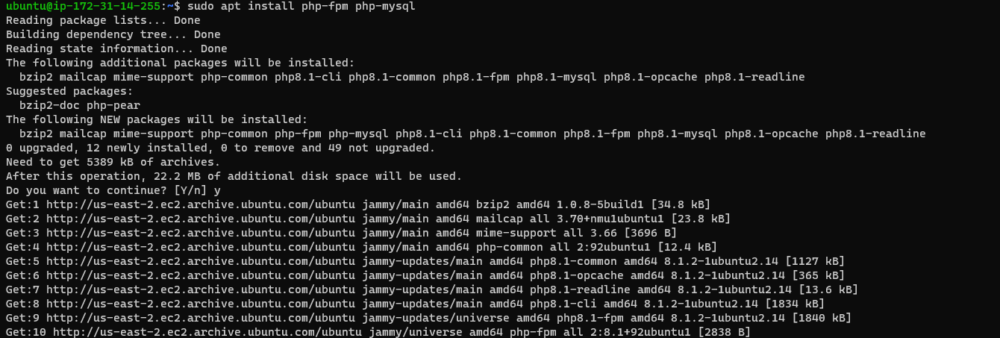

# WEB STACK IMPLEMENTATION (LEMP STACK) PROJECT

This is similar to LAMP STACK Project THREE, but with an alternate Web Server - ***NGINX*** which is popular and widely used by many websites in the internet.

#### PREPARATION PREREQUISITES 

An AWS Account is very vital to have, it is where you will create an Ubuntu server. While creating the server, ensure you create a Pem Key pair and download it as this will be used to connect to the EC2 instance launched.

Download and install [Git Bash](https://git-scm.com/downloads) which is a simpler way to connect with **SSH** into our server.

After installing, launch the Git Bash with this command:

>     ssh -i <Your-private-key.pem> ubuntu@<EC2-Public-IP-address>

#### Step 1
## Installing the Nginx Web Server

Nginx will be used to display web pages to our visitors',it is a high-performance web server. 

Before you install Nginx, update your server's package index

>       sudo apt update

Then go ahead and install Nginx
>       sudo apt install nginx

Once the installation is finished, Nginx web server will be active and running on your Ubuntu server. You can check that with:

>       sudo systemctl status nginx

If it is green and running,then you did everything correctly and you just launched your first Web Server in the Cloud!

Go ahead and configure inbound connection through port 80 in your AWS EC2 machine (we have TCP port 22 open by default)

Our server is now running and we can access it locally and from the Internet (Source 0.0.0.0/0 means 'from any IP address')

The 2 commands below are pretty much the same,  they do the same thing.They use *curl* command to request Nginx on port 80(or no port specify). The first one is to access our server via `DNS name`
and the second code uses IP address(IP address 127.0.0.1 corresponds to DNS name 'localhost, and the process of converting a DNS name to IP address is called "resolution")

>       $ curl http://localhost:80
or
>       $ curl http://127.0.0.1:80

> 

 or

> 

These 2 outputs shows us that Nginx is responding to *curl* command with some payload.

Now we can test to see how Nginx can respond to requests from the Internet. Open a browser of your choice and try to access using this url

    http://<Public-IP-Address>:80 (Retrieve your IP address from AWS Web console)

If you see the page beneath. Then your web server is installed correctly and accessible through firewall.

It is the same content we got through *curl*command, but represented nicely with HTML formatting by your web browser

You can also retrieve your IP address, other than to check it in AWS Web console with the following 

curl -s http://169.254.169.254/latest/meta-data/public-ipv4

#### Step 2
## Installing MySQL

The next step is to install a Database Management System for storage and management of the data on your site in a relational database and MySQL is the popular one used with PHP environments.

To install MySQL:

Run the command below to install MySQL software and when prompted to confirm installation, type Y.

>            sudo apt install mysql-server

Login to the MySQL console with the code below and this will connect to the MySQL server as the administrative database User root which is inferred by the use of sudo when running the command.

>             sudo mysql

You are advised to run a security script that comes pre-installed with MySQL. This script will remove some insecure default settings and lock down access to your database system. before running the script, you will set a password for the root User, using mysql_native _password as default authentication method. We are defining this user's password here as PassWord.1

>         ALTER USER 'root'@'localhost' IDENTIFIED WITH mysql_native_password BY 'PassWord.1';

Exit the MySQL with:

>             mysql>exit

Now we will start an interactive script by running:

> $         sudo mysql_secure_installation

This will ask you if you want to configure the VALIDATE PASSWORD PLUGIN (note that enabling this feature is a judgement call, and if enabled, passwords which do not match the specified criteria will be rejected by MySQL with an error), so it is safe to leave it as disabled but use strong and unique passwords

After you answer yes, you will need to select a level of password verification (selecting 2 means strongest level as you will get errors when password does not contain numbers, upper and lowercases letters, and special characters).

Please note that this password asked is the MySQL root user as the frst password set is the database root User password. You will be shown the password strength that you just entered if password validation is enabled and you satisfied with the password enter Y for yes at the prompt.

For the rest of questions press Y and hit Enter at each prompt.This will prompt you to change root password, remove some anonymous users and test database, disable remote root logins and load these new rules so that MySQL immediately respects the changes made.

When finished, test if login is successful running the below command. The -p flag will prompt for password used after changing the root user password

>           sudo mysql -p

  

Once you succesfully logged in, you can then exit MySQL console with:

>            mysql>exit

For increase security, its best to have dedicated user accounts with less expansive privileges set up for every database, especially if you plan on having multiple databases hosted on your server.

MySQL server is now installed and secured. 

#### Step 3
## Installing PHP

Nginx has been installed to serve contents and MySQL has been installed to store and manage data. Now we can install **PHP** to process code and generate dynamic content for the webserver. This is the final component in the LEMP stack.

Nginx requires an external program to handle **PHP** to processing and act as a bridge between **PHP** interpreter and the web server.This allows for a better overall performance in most PHP-based websites, but it requires additional configuration. You'll need to install *php-fpm*, which stands for "PHPfastCGI process manager", and tell Nginx to pass PHP requests to this software for processing. Additionally, you'll need **php-mysql**, a PHP module that allows PHP to communicate withMySQL-based databses. Core PHP packages will automatically be installed as dependencies.

We will go ahead and install these 2 packages at once:

>        $ sudo apt install php-fpm php-mysql

When propmted, type **Y** and press **ENTER** to confirm installation.

You now have PHP components installed.

#### Step 4
## Configuring Nginx to Use PHP Processor

When using the Nginx webserver, we can create server blocks(similar to virtual hosts in Apache) to encapsulate configuration details and host more than one domain on a single server. projectLEMP will be our example domain name.

On Ubuntu, Nginx has one server block enabled by default and is configured to serve documents out of a directory at ***/var/www/html***. While this works well for a single site, to host multiple sites may become difficult to manage. So rather than modifying the ***/var/www/html***, its better to create a directory structure within ***/var/www*** for the **your_domain** website. This allows the ***/var/www/html*** untouched as the default directory to be served if a client request does not match any other sites.

To do this, we will create the root web directory **your_domain** as follows:

>      $ sudo mkdir /var/www/projectLEMP

Next, assign ownership of the directory with the $USER environment variable, which will reference your current system user:

>        $ sudo chown -R $USER:$USER /var/www/projectLEMP

Then, open a new configuration file in Nginx's ***sites-available*** directory with ***nano*** (You can use any command-line-editor of your choice)

>     $ sudo nano /etc/nginx/sites-available/projectLEMP

This will create a new blank file, where you will paste the **bare-bones configuration below**

    #/etc/nginx/sites-available/projectLEMP
 
    server {

        listen 80;
        server_name projectLEMP www.projectLEMP;
        root /var/www/projectLEMP;
    
        index index.html index.htm index.php;

        location / {
            try_files $uri $uri/ =404;
        }

        location ~ \.php$ {
            include snippets/fastcgi-php.conf;
            fastcgi_pass unix:/var/run/php/php8.1-fpm.sock;
        }

        location ~ /\.ht {
            deny all;
        }

    }

Here's what each of these directives and location blocks do:

- `listen`- Defines what port Nginx will listen on. In this case, it will listen on port `80`, which is the default port for HTTP.
- `root`- Defines the document root where the files served by this website are stored.
- `index`- Defines in which order Nginx will prioritize index files for this website. It is a common practice to list `index.   html` files with a higher precedence than `index.php` files to allow for quickly setting up a maintenance landing page in PHP applications. You can adjust these settings to better suit your application needs.
- `server_name`- Defines which domain names and/or IP addresses this server block should respond for. ***Point this directive to server's domain name or public IP address**.
- `location/`- The first location blocks includes `try_files` directive,which checks for the existence of files or directories matching a URL request. If Nginx cannot find the appropriate resource, it will return a 404 error.
- `location ~ \.php$ `- This location block handles the actual PHP processing by pointing Nginx to the ***fastcgi-php.conf*** configuration file and the `php7.4-fpm.sock file`, which declares waht socket is associated with `php-fpm`.
- `location ~ /\.ht`- The last location block deals with `.htaccess` files, which Nginx does not process. By adding the deny all directive, if any `.htaccess` files happens to find ther way into the document root, they will not be served to visitors.

Save and close the `nano` editor and activate your configuration by linking to the config file Nginx's `sites-enabled`directory:

>       $ sudo ln -s /etc/nginx/sites-available/projectLEMP /etc/nginx/sites-enabled/

This will tell Nginx to use the configuration at next reload. 

Test your configuration for syntax errors with this code:
>         sudo nginx -t

If there is an error, retrace your step into your configuration file to review its content.

Also, we need to disable default Nginx host that is currently configured to listen on port 80, for this to run. Use the code below:

>       sudo unlink /etc/nginx/sites-enabled/default

After this, you will reload Nginx to apply the changes:

>        $ sudo systemctl reload nginx

The new website should be active, but ***/var/www/projectLEMP*** the web root is empty. We will create an ***index.html*** file in that location to test that the new server block is working using this code below:

> sudo echo 'Hello LEMP from hostname' $(curl -s http://169.254.169.254/latest/meta-data/public-hostname) 'with public IP' $(curl -s http://169.254.169.254/latest/meta-data/public-ipv4) > /var/www/projectLEMP/index.html
 
Now go to a browser and open your website URL using your IP address (from the Ubuntu server)

    http://<Public-IP-Address>:80

    http://<Public-DNS-Name>:80

You should see the text from ***echo*** command you wrote in the ***index.html*** file. In the output you will see your server's public hostname(DNS) and public IP address. OR you can access by your public DNS name

 
You can leave this file in place as a temporary landing page for your application until you set up an `index.php` file to replace it. Once you do that, remember to remove or rename the  `index.html` file from your document root, as it would take precedence over an `index.php` file by default.

Your LEMP stack is now fully configured.

#### Step 5
## Testing PHP with Nginx

We will be validating that Nginx can correctly hand `.php` off to your PHP processor.

Create a test PHP file in your document root. Open a new file called `info.php` within your document root in your text editor:

>       $ nano /var/www/projectLEMP/info.php
> 

This will open an empty text document. Type or paste the following lines into the new file. It is a valid PHP code that will return information about your server:

>       <?php
>        phpinfo();

Now you can access this page in any web browser and run:

http://projectLEMP/info.php

Use the domain name( in this case my domain is projectLEMP) or Public IP address you set up in your Nginx configuration. And your output should look like this below

NOTE: After checking the relevant information about your PHP server through that page, it's best to remove the file you created as it contains sensitive information about your PHP environment and your Ubuntu server. You can use `rm` to remove that file:

>         $ sudo rm /var/www/projectLEMP/info.php

You can always regenerate this file if you need it later.

#### Step 6
## Retrieving data from MySQL database with PHP

We will be creating a test database(DB) with simple "To do list" and configure access to it, so the Nginx website would be able to query data from the DB and display it.

We'll need to create a new user with the `mysql_native_password` authentication method in order to be able to connect to the MySQL database from PHP.

A database will be created an named ***example_database*** and a user named ***example_user***. but you can replace these names with different values.

Lets connect first to the MySQL console using **root** account:

>         sudo mysql

Then create a new database, running the following command from the MySQL console:

>         mysql> CREATE DATABASE `example_database`;

>       mysql>  CREATE USER 'example_user'@'%' IDENTIFIED WITH mysql_native_password BY 'PassWord.1';
>       mysql> GRANT ALL ON example_database.* TO 'example_user'@'%';

The new user is name `example_user`, using mysql_native_password as default authentication method. We will define the password as `PassWord.1`, you can replace this password with a secure password of yours choosing.

Then we create a  new user, granting him full privileges on the database created.

Exit MySQL

>           mysql>exit

You can go ahead and test if the new user has the proper permissions by logging into MySQL console again, this time using the custom user credentials

>         $ mysql -u example_user -p

Once you log in, confirm that you have access to the `example_database` database:

>          mysql> SHOW DATABASES;

Which will give you this output below:

Next, we'll create a test table named **todo_list**. Run this statement from the MySQL console:

> CREATE TABLE example_database.todo_list (item_id INT AUTO_INCREMENT,content VARCHAR(255),PRIMARY KEY(item_id));

> mysql> INSERT INTO example_database.todo_list (content) VALUES ("My first important item");

Go ahead and insert a few rows of content in the test table. You might want to repeat the next command a few times, using different **Values** and you will get the output below, depending on the values you inputted.

Once confirmed, you can exit MySQL

>         mysql> exit

Now you can create a PHP script that will connect to MySQL and query for your content. Create a new PHP file in your custom web root directory using your preferred editor.  I am using nano

> $ nano /var/www/projectLEMP/todo_list.php

This will open a CLI text editor, copy the content below into your `todo_list.php` script:

    <?php
    $user = "example_user";
    $password = "PassWord.1";
    $database = "example_database";
    $table = "todo_list";

    try {
      $db = new PDO("mysql:host=localhost;dbname=$database", $user, $password);
      echo "<h2>TODO</h2><ol>";
      foreach($db->query("SELECT content FROM $table") as $row) {
        echo "<li>" . $row['content'] . "</li>";
      }
      echo "</ol>";
    } catch (PDOException $e) {
        print "Error!: " . $e->getMessage() . " ";
        die();
    }

Save and close after editing. 

Access the new page in your web browser by visiting the domain name or public IP address configured for your website, followed by `/todo_list.php`:

http://projectLEMP>/todo_list.php

A page like this should show:

