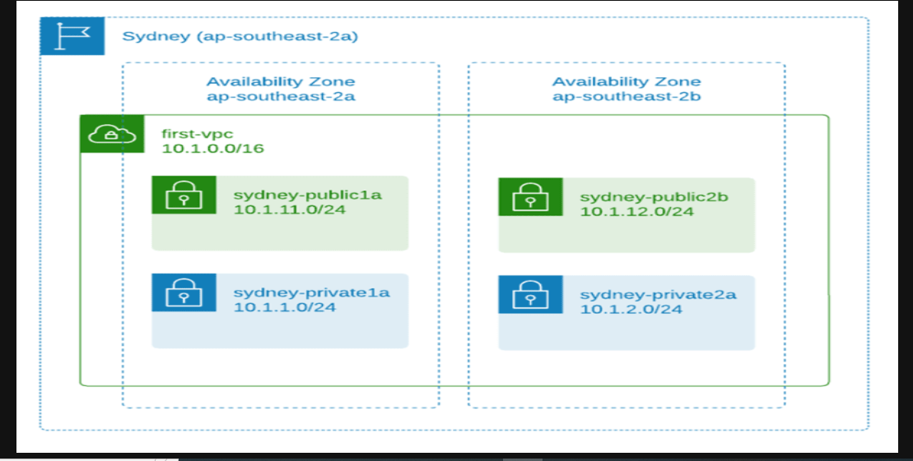
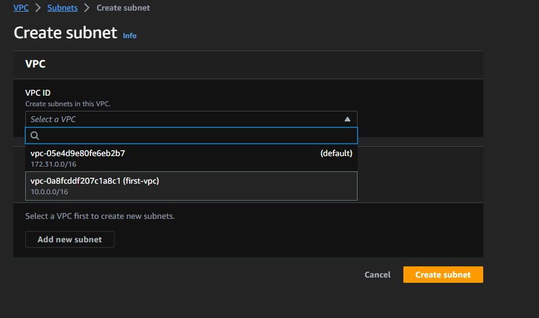

# AWS Networking Implementation Project (VPC, Subnets, Internet Gateways, NAT, Routing) By Adedoyin Ekong

### What is an Amazon VPC?

An amazon Virtual Private Cloud (VPC) is like your private sector of the Amazon cloud, where you can place and manage your resources (like servers or databases). You control who and what can go in an out.

#### The esential steps to creating a VPC and configuring core network services involves the following:
- The Deafult VPC
- Creating a new VPC
- Creating and configuring subnets

#### The Default VPC

The default VPC is like a starter pack provided by Amazon for your cloud resources. Its a pre-configured space in the Amazon cloud where you can immediately start to deploy your applications or services. It has a built-in security and network settings to help get running quickly, and this can also be adjusted to fit as you want.

A default VPC, which Amazon provides for you in each region, is like a pre-built house in that city This house comes with some default settings to help you move in and start living (Start deploying your applications) immediately. But just like a real house, you can change these settings according to your needs.

Each Availabilty Zones have different VPC's allocated by defaults.

#### Creating a new VPC

To create a new VPC for this project, follow the steps below
- Choose the `VPC only`option
- Enter a name tag. I used `first-vpc`
- Use `10.0.0.0/16` as the IPv4 CIDR(This will be the primary IPv4 block and you can add a secondary IPv4 block e.g `100.64.0.0/16`) The use of a seconadry CIDR block could be because you are running out of IP's and need to add additional block, or thers's a VPC with overlapping CIDR which you need to peer or connect.

As soon a the VPC is created, it is assigned with a vpc-id and there is a `route table`created that serves as the main route table

Now you have a VPC and Route table, but you wont be able to put anything inside. If you try to create an EC2 instance, you wont be able to proceed.

####  Creating and Configuring Subnets

***What are Subnets?***

Subnets are like smaller segments withing a VPC that help you organize and manage your resources. Subnets are like dividing an office building into smaller sections, where each section represents a department. 

We will create public and private subnets with the below data

>   SUBNET NAME         /           AZ               /       CIDR BLOCK

>   subnet-public1a     /        us-east-1a         /         10.0.11.0/24

>   subnet-public2b     /        us-east-1b         /         10.0.12.0/24

>   subnet-private1a    /        us-east-1a         /         10.0.1.0/24

>   subnet-private2b    /        us-east-1b          /        10.0.2.0/24

Go to VPC > Subnets > Create Subnets and select VPC that was created previously (first-vpc) or anything you tagged your VPC as.

Once done, you should see all the subnets you just created on the console. If you missed any, just create a subnet and select your desired VPC. As at now, you can EC2 instances into the VPC by selecting one of the subnets, but the public subnets does not have any internet access at this stage. You will realise that the public subnets only uses the main route table and only has the local route, no default route for internet access.

## Understanding Public and Private Subnets in AWS VPC

In the world of AWS VPC, think of subnets as individual plots in your land (VPC) Some of these plots have direct road access(internal access)- these are public subnets. Others are more private, tucked aws without direct road access - these are the private subnets.

#### Creating a Public Subnet

Here's how to Create Public Subnet 
- Go to the AWS VPC page.
- Find `Subnets`, click on it, then click `Create Subnet`.
- Give this new plot(Subnet) a name, select the big plot (VPC) that you want to divide, and leave the IP settings as they are.
- Attach an `Ìnternet Gateway` to this subnet to provide the road(Internet) access.
- Update the `route table associated`with this subnet to allow traffic to flow to and from the internet.

#### Creating a Private Subnet

Here's how to create the Private Subnet
- Go to AWS VPC page
- Find `Subnets`, click on it, then click `Create Subnet`.  Give this new plot(Subnet) a name, select the big plot (VPC) that you want to divide, and leave the IP settings as they are.
- Don't attach an Internet Gateway to this subnet, keep it secluded.
- The route table for this subnet doesnt allow direct traffic to and from the internet

#### Working with Public and Private Subnets

Public subnets are great for resources that need to connect to the internet, like web servers. Private subnets are great for resources that you dont want to expose to the internet, like `databases`.

## Internet Gateway and Routing Table

An internet gateway in AWS is like a road that connects your city (VPC) to the outside world(The internet). Without this road, people (data) can't come in or go out of your city (VPC).

### Public Subnets

Technically, the subnets we created are still private. We need to make it work as public subnets by creating the following:

- An `Internet Gateway` (IGW) attached to the VPC
- Route table with default route towards the IGW
- Public IP assigned to the AWS resources (e.g EC2 Instance)

**Go to VPC > Internet Gateways and click "Create internet gateway"**

**Put a name tag and click create internet gateway**

**Attach the IGW to the VPC (first-vpc)**

**Select the VPC**

We will will create a separate route table for the public subnets, because we dont want the Private subnets to have a default route to the internet.

### What is a Routing Table?

A routing table is like a map or GPS. It tells the people(data) in your city(VPC) which way to go to reach their destination. For example, if the data wants to go to the internet, the Routing table will tell it to take the road(Internet Gateway) that we built.

#### Creating and Configuring Routing Tables

Now that we have our entance and exit(Internet Gateway), we need to give directions to our resources. This is done through `Routing Table`. Its like a map, guiding your resources on how to get in and out of your VPC.

To create a Routing table for the public subnets. Go to VPC and select route tables

Put a name for the route table. I named mine `test-vpc-public-rtb` 

Once created, edit the route table, add a default route to the Internet Gateway (IGW)

Next go to the `Subnet associations` tab and click `Edit subnet associations`. Then select the public subnets and click `Save associations`

With that our VPC is ready and we can run an EC2 instance in public subnets if they need Internet access or in private subnets if they dont.

***Note***
**test-vpc-public-rtb** is a route table with a target to Internet Gateway is a public route table.
**test-vpc-private-rtb** is a route table with a target to NAT gateway is a private route table.

I will also create the route table for the private subnets without attaching any route to it.

## NAT Gateway and Private Subnets

In the AWS Virtual Private Cloud(VPC) private subnets are secluded areas where you can nplace resources that should not be directly exposed to the internet. But what if these resources need to access the internet for updates and downloads? That is where the NAT Gateway comes in.

A private subnet in AWS is like a secure room inside your house(VPC) with no windows or doord to the street (Internet). Anything you place in this room(like database) is not directly accesible from the outside world.

### Understanding NAT Gateway

A Network Address Translation(NAT) Gateway acts like a secure door that only opens one way. It allows your resources inside the private subnet to access the internet for things like updates and downloads, but it doesnt allow anything from the internet to enter your private subnets.

#### Creating a NAT Gateway and Linking it to a Private Subnet

Go to VPC > NAT Gateways and click `Create NAT Gateway`

Create the NAT Gateway named `test-nat` under one of the private subnets which I choose the ***subnet-private 1a*** as the subnet.

You need to allocate `Elastic IP` because it is required for the creation of NAT Gateway

Now we can go to the route table menu and create a route table for the Private subnets

Choose route table RTB- Private > Route tab > Add route. Under Target, select Tthe NAT gateway names `test-nat`

Next go to the `Subnet associations` tab and click `Edit subnet associations`

That is it for now!