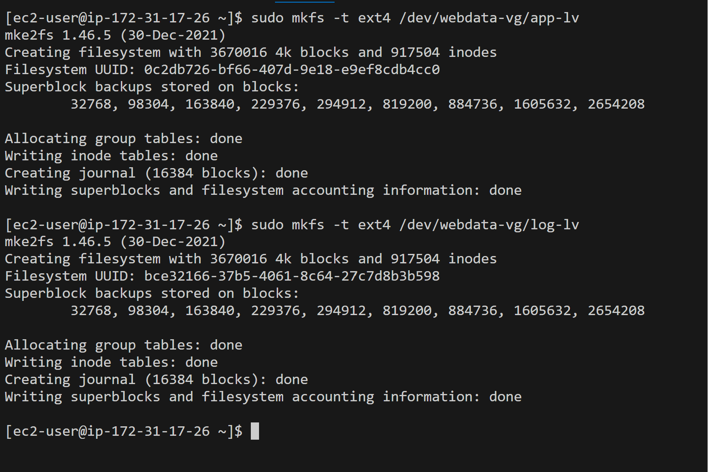

# Implementing WordPress website with Logical Volume Management (LVM)

### Project Scope:

Configure storage subsystem for Web and Database servers, we will work with disks, partitions, and volumes in Linux.

Install WordPress and connect it to a remote My SQL database server.

### Three-tier Architecture
Generally, web or Mobile solutions are Implemented based on what is called Three-tier Architecture

***Presentation Layer(PL)***: This is the user interface such as the client-server or browser on your Laptops.

***Business Layer(BL)***: This is the backend program that implements business logic. Application or webserver.

***Data Access or Management Layer(DAL)***: Layer for the computer data storage and data access. Database server or File system such as FTP server or NFs server.

## IMPLEMENTING LVM ON LINUX SERVERS (WEB SERVER AND DATABASE SERVER)

#### PREREQUISTE:

- Two Cloud Servers: a WebServer and a Database Server
- Both servers to run on RedHatLinux OS
- Linux Terminal(Git Bash) ON VSCODE
- Ability to connect the terminal to the cloud environment using SSH.

#### STEP 1 

### Spin up webserver Instance 

1. Spin up a webserver instance to run on RedHat linux OS and connnect the webserver to the terminal by doing SSH

Create the volumes of 10G for the web server

2. Attach all 3 volumes to the webserver instance.

3. SSH and connect into the webserver. Use lsblk to inspect what block devices are attached to the server. Names of the created volumes will show as 

All devices reside in /dev/directory, inspect it with ls /dev/

4. Use `df -h` to see all mounts and free space on your server

5. Use `gdisk` to create a single partion on each disks

>       sudo gdisk /dev/xvdf
>       sudo gdisk /dev/xvdg
>       sudo gdisk /dev/xvdh

6. Use `lsblk` to view the configured partitions.

7. Run the command below to install the LVM2 Package and check for available partitions

8. Mark each of the 3 disks as Physical Volume (PV) to be used by LVM (Logical Volume Management) and check if it has been created successfully by running the below commands:

>       sudo pvcreate /dev/xvdf1
>       sudo pvcreate /dev/xvdg1
>       sudo pvcreate /dev/xvdh1

9. Use the ***vgcreate*** utility below to add all 3 VPs to a volume group (VG). I gave it a name ***webdata-vg*** and check if it successed with `sudo lvs`

>       sudo vgcreate webdata-vg /dev/xvdh1 /dev/xvdg1 /dev/xvdf1

10. Use **lvcreate** utility to create 2 logical volumes. app-lv (Use half of the PV size), and log-lv Use the remaining space of the PV size. NOTE: app-lv will be used to store data for the Website while, log-lv will be used to store data for logs.

>       sudo lvcreate -n app-lv -L 14G webdata-vg
>       sudo lvcreate -n log-lv -L 14G webdata-vg

 And use the below code to check

>       sudo lvs

11. Verify the entire setup

>       sudo vgdisplay -v #view complete setup - VG, PV, and LV
>       sudo lsblk 

12. Format logical volumes with ext4 file system

>       sudo mkfs -t ext4 /dev/webdata-vg/app-lv
>       sudo mkfs -t ext4 /dev/webdata-vg/logs-lv

13. Create `/var/www/html` dirctory to store the website files 

>       sudo mkdir -p /var/www/html

14. Create `/home/recovery/logs` to store backup of log data

>       sudo mkdir -p /home/recovery/logs

15. Mount `/var/www/html` on apps-lv logical volume and Use `rsync`utility to backup all the files in the log directory `/var/log` into `/home/recovery/logs` (This is required before mounting the file system)

>       sudo mount /dev/webdata-vg/apps-lv /var/www/html
>       sudo rsync -av /var/log/. /home/recovery/logs/ 

16. mount `/var/log` on logs-lv 

>       sudo mount /dev/webdata-vg/logs-lv /var/log

17. Mount `/var/log` on `logs-lv` logical volume. (Note that all the existing data on /var/log will be deleted. That is why step 13 above is very important) Then restore log files back into /var/log directory
>       sudo mount /dev/webdata-vg/logs-lv /var/log

>       sudo rsync -av /home/recovery/logs/. /var/log

18. Update `/etc/fstab` file so that the mount configuration will persist after restart of the server.

The UUID of the device will be used to update the /etc/fstab file;

>       sudo blkid

Open the /etc/fstab file in text editor with the command below

>       sudo vi /etc/fstab

Then update /etc/fstab in this format using your own app and log UUID and rememeber to remove the leading and ending quotes.

19. Test the configuration and reload the daemon

>       sudo mount -a
>       sudo systemctl daemon-reload

20. Verify your setup by running `df -h`, output must look like this:

#### Step 2
### Prepare the Database Server

1. Launch a second RedHat EC2 instance that will have a role – `DB-Server` Repeat the same steps as for the `Web Server`, but instead of `apps-lv` create `db-lv` and mount it to `/db` directory instead of `/var/www/html/`.

Attach volumes as well to this instance

#### Step 3
### Install WordPress on your Web Server EC2

1. Update the repository

>       sudo yum -y update

2. Install wget, Apache and it’s dependencies

>       sudo yum -y install wget httpd php php-mysqlnd php-fpm php-json

3. Start Apache

>       sudo systemctl enable httpd
>       sudo systemctl start httpd

4. To install PHP and it’s depemdencies, use the commands below:

>       sudo yum install https://dl.fedoraproject.> org/> pub/epel/epel-release-latest-8.noarch.rpm
>       sudo yum install yum-utils http://rpms.remirepo.net/enterprise/remi-release-8.rpm
>       sudo yum module list php
>       sudo yum module reset php
>       sudo yum module enable php:remi-7.4
>       sudo yum install php php-opcache php-gd php-curl php-mysqlnd
>       sudo systemctl start php-fpm
>       sudo systemctl enable php-fpm
>       setsebool -P httpd_execmem 1

5. Restart Apache

>       sudo systemctl restart httpd

6. Download wordpress and copy wordpress to `var/www/html`

>       mkdir wordpress
>       cd   wordpress
>       sudo wget http://wordpress.org/latest.tar.gz
>       sudo tar xzvf latest.tar.gz
>       sudo rm -rf latest.tar.gz
>       cp wordpress/wp-config-sample.php wordpress/wp-config.php
>       cp -R wordpress /var/www/html/

7. Configure SELinux Policies

>       sudo chown -R apache:apache /var/www/html/wordpress
>       sudo chcon -t httpd_sys_rw_content_t /var/www/html/wordpress -R
>       sudo setsebool -P httpd_can_network_connect=1

#### Step 4

### Install MySQL on your DB Server EC2

1. Update the server and install mysql

>       sudo yum update
>       sudo yum install mysql-server

2. Verify that the service is up and running by using `sudo systemctl status mysqld`, if it is not running, restart the service and enable it so it will be running even after reboot:

>       sudo systemctl restart mysqld
>       sudo systemctl enable mysqld

3. Verify that the service is running 
>       sudo systemctl status mysqld

#### Step 5

### Configure DB to work with WordPress

>       sudo mysql
>
>       CREATE DATABASE wordpress;
>
>       CREATE USER `myuser`@`<Web-Server-Private-IP-Address>` IDENTIFIED BY 'mypass';
>
>       GRANT ALL ON wordpress.* TO 'myuser'@'<Web-Server-Private-IP-Address>';
>
>       FLUSH PRIVILEGES;
>
>       SHOW DATABASES;
>
>       exit

#### Step 6

### Configure WordPress to connect to remote database.

Hint: Do not forget to open MySQL port 3306 on DB Server EC2. For extra security, you shall allow access to the DB server ONLY from your Web Server’s IP address, so in the Inbound Rule configuration specify source as /32

1. Install MySQL client and test that you can connect from your Web Server to your DB server by using mysql-client

>       sudo yum install mysql
>       sudo mysql -u admin -p -h <DB-Server-Private-IP-address>

Verify if you can successfully execute SHOW DATABASES; command and see a list of existing databases.

3. Change permissions and configuration so Apache could use WordPress

4. Enable TCP port 80 in Inbound Rules configuration for your Web Server EC2 (enable from everywhere 0.0.0.0/0 or from your workstation’s IP)

5. Try to access from your browser the link to your WordPress http://<Web-Server-Public-IP-Address>/wordpress/

