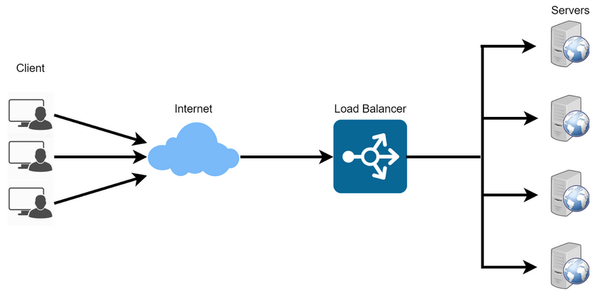
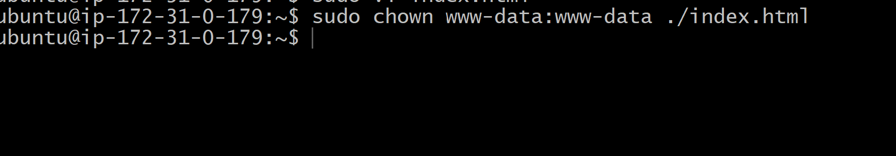

# Implementing Load Balancers with Nginx

### Introduction to Load Balancing and Nginx

#### Loadbalancer in simple explanation:
Imagine you have a large group of people trying to enter a building through a single door. The door quickly becomes a bottleneck, causing congestion and delays. To improve the flow of people, you can open multiple doors, each leading to different sections of the building. This effectively distributes the crowd, reducing congestion and making entry more efficient.

Similarly, a load balancer acts as multiple doors for incoming traffic, distributing requests across multiple servers to improve overall performance and reliability.

By doing this, no single server gets overwhelmed with too much traffic, and every server gets to share the load. This prevents crashes, slowdowns, and annoying error messages, making sure that users like you and me have a smooth and enjoyable experience while browsing websites or using online applications.

Lets say you have a set of webservers serving your website, in other to distribute the traffic evenly between the webservers, a loadbalancer is deployed. The load balancer stands in front of the webserver, all traffic gets to it first, it then distributes the traffic accross the set of webservers. This is to ensure no webserver gets overworked, consequently improving system performance.

Nginx is a versatile software, it can act like a webserver, reverse proxy,and load balancer etc. All you need is to configure it to how you want it used. 

### Setting up a Basic Load Balancer

We are going to provision two EC2 instances runnning on Ubuntu 22.04 and the install Apache webserver in them. We will open port 8000 to allow traffic from anywhere and finally update the default page of the webservers to dispay their public IP address.

Next, we will provision another instance running on Ubuntu 22.04 and this time install Nginx on it and configure it to serve as a load balancer distributing traffic across the webservers.

Step 1 : Provision 2 x Ubuntu Linux EC2 instances in AWS Management Console with unique names for easy identification.

Check that your servers are up and running

Open port 8000. We will run our webservers on port 8000 while the load balancer will run on port 80. We need to allow port 8000 to run anywhere by adding a rule to to the security group of each of our webservers.

Click on the instance ID to get the details of your EC2 instance.
On that same page, scroll down and click security. Click on Security Group and the Edit Inbound Rules
Click on Add Rule and input port 8000, then select Anywhere-IPV4. Click on save Rules.

#### Install Apache Webserver

We will now go ahead and Install Apache Webserver

First, open a terminal in your local machine. cd into your Download folder. Paste the SSH command copied from your AWS(connect to instance) page then connect to each of the webservers via SSH and then run commands on the terminal of the webservers.

Once you are connected, we will go ahead and install Apache on the 2 servers. Always remember to do update on the server before installing any package. Here we will combine the update and install with one code to run.

>       sudo apt update -y &&  sudo apt install apache2 -y

Verify the apache is running using the command below:

>          sudo systemctl status apache2

#### Configure apache to serve content on port 8000:

Next, we will configure Apache to serve a page showing its public IP
content on port 8000 instead of the default port 80. We then create a new index.html file which will contain code to display the public IP of the EC2 instance. We will override Apache webserver's default html file with our new file.

Configuring Apache to serve content on port 8000. We will open the below code in a text editor(vi,nano etc).

>       sudo vi /etc/apache2/ports.conf 
Add a new Listen directive for port 8000 under the default 80

Then, you will open the file /etc/apache2/sites-available/000-default.conf and change port 80 on the virtual host to 8000 as in the below snapshot.

>       sudo vi /etc/apache2/sites-available/000-default.conf

Save and close the file, and restart apache to load the new configurations using the command below:

>       sudo systemctl restart apache2

##### Create our new html file:

Open a new ***index.html*** file with the command below:

>           sudo vim index.html

Get the public IP of your EC2 instance from AWS Management Console. Copy the code below and paste inside the file. Then replace the placeholder text for IP address in the html file

>
>         
         <!DOCTYPE html>
        <html>
        <head>
            <title>My EC2 Instance</title>
        </head>
        <body>
            <h1>Welcome to my EC2 instance</h1>
            
Public IP: YOUR_PUBLIC_IP

        </body>
        </html>

 
Save and close.

We will change the file ownership

Use the code below to change the ownership of the html.index file

>       sudo chown www-data:www-data ./index.html

#### Override the default html file of Apache Webserver:

To do this, we will replace the default html file with our new html file using the command below:

>       sudo cp -f ./index.html /var/www/html/index.html

Restart the webserver to load the new configuration using the command below:

>       sudo systemctl restart apache2

Now, you should be able to find a page on the browser similar to the below, using your public IP opened with port 8000:

### Configuring Nginx as a Load Balancer

To set up Nginx as a load balancer, we will need to Provision another EC2 Instance running ubuntu 22.04. Make sure the port 80 is opened to accept traffic from anywhere. Use the step we followed to provision the 2 Apache servers above.

Port 80 rule configuration

After it is up and running, we will SSH into the instance to provision the server. 

Then we install Nginx into the instance. Remember to update the server. This we will do together with the install Nginx with the code below

>           sudo apt update -y && sudo apt install nginx -y

Go ahead and verify that nginx is installed with:

>       sudo systemctl status nginx

*****Open Nginx configuration file to input the IP addresses of the 2 webservers provisioned earlier and the Nginx IP as the loadbalancer*****

Use any text editor of choice with the code below

>       sudo vi /etc/nginx/conf.d/loadbalancer.conf

Paste the configuration below in the file to configure nginx to act as a load balancer.

>               
        upstream backend_servers {

            # your are to replace the public IP and Port to that of your webservers
            server 127.0.0.1:8000; # public IP and port for webserser 1
            server 127.0.0.1:8000; # public IP and port for webserver 2

        }

        server {
            listen 80;
            server_name <your load balancer's public IP addres>; # provide your load balancers public IP address

            location / {
                proxy_pass http://backend_servers;
                proxy_set_header Host $host;
                proxy_set_header X-Real-IP $remote_addr;
                proxy_set_header X-Forwarded-For $proxy_add_x_forwarded_for;
            }
        }
    

Upstream backend servers define a group of backend servers. The server lines inside the upstream block list the addresses and ports of your backend servers. proxy_pass inside the location block sets up the load balancing, passing the requests to the backend servers. The proxy_set_header lines pass necessary headers to the backend servers to correctly handle the requests.

#### Test your configuration with the command below:

>       sudo nginx -t

If there are no errors, restart Nginx to load the new configuration with this s=command;

>       sudo systemctl restart nginx

Paste the Public IP address of the Nginx load balancer into a browser and you should see the same webpages served previously by the webservers.

