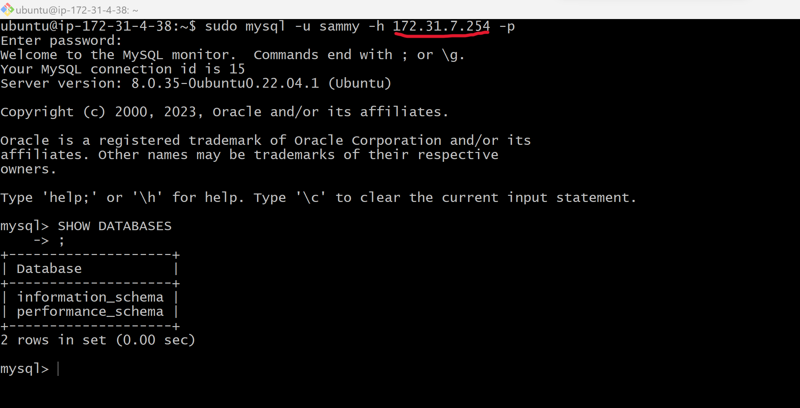

# Client Server Architecture with MySQL as RDBMS

Client server refers to an architecture in whicg 2 or more computers are connected together over a network to send and receive requests between one another. 

### Implementation:
Create and configure 2 Linux-based virtual servers (EC2 Instances in AWS)

>    `Server A name - `mysql server``
>
>    `Server B name - `mysql client``

Once the Instances are up and running, we will connect to them remotely  and then always do 'apt update' on new servers, before installing or configuring any thing on it.

***MySQL Server connection and update***

***MySQL Client connection and update***

Install MySQL Server software on `mysql server` Linux Server

Install MySQL Client software on `mysql client` Linux Server

By default, both of the EC2 virtual servers are located in the same local virtual network, so they can communicate with each other using local IP addresses. We use ***mysql server’s*** local IP address to connect from ***mysql client***. MySQL server uses TCP port 3306 by default, so we must open it by creating a new entry in **Inbound rules** in ***mysql server*** Security Groups. For extra security, do not allow all IP addresses to reach the ***mysql server***. Allow access only to the specific local IP address of the ***mysql client***.

You will now configure MySQL server to allow connections from remote hosts, with the below code:

>       sudo vi /etc/mysql/mysql.conf.d/mysqld.cnf 
 which will open a text editor and you **Replace '127.0.0.1' with '0.0.0.0'**. After which you save and close the editor.

Now we will connect remotely to ***mysql server*** Database Engine from ***mysql client*** Linux server. This will be done using **mysql utility** and not **SSH**

First we will secure the mysql server deployment, making it secure from anyone without permision. Now we will start an interactive script by running:

>       sudo mysql_secure_installation

Once completed, log in, create user and create a database

We can list all users in our database with the command:

>          select user,plugin,host from mysql.user;

Once you can confirm your user is configured. Go ahead and connect to ***mysql server** from ***mysql client***  

>       sudo mysql -u sammy -h 172.31.7.254 -p
and 
>       SHOW DATABASES

'NOTE: The IP used is the Private IP of MySQL Server'

Once you get an output similar to above then you have deployed a fully funtional MySQL Client-Server set up.

