# DEVOPS TOOLING WEBSITE SOLUTION PROJECT

## NFS 3-TIER ARCHITECTURE

Three-tier Architecture is a client-server software architecture pattern that comprise of 3 separate layers.
Presentation Layer (PL): This is the user interface such as the client server or browser on your laptop.

Business Layer (BL): This is the backend program that implements business logic. Application or Webserver

Data Access or Management Layer (DAL): This is the layer for computer data storage and data access. Database Server or File System Server such as FTP server, or NFS Server

Your 3-Tier Setup

1.A Laptop or PC to serve as a client

2.An EC2 Linux Server as a web server (This is where you will install WordPress)

3.An EC2 Linux server as a database (DB) server

In this project we are using REDHAT OSinstead of ubuntu

# Project
### DevOps Tooling Website Solution

As a member of a DevOps team, I will be implementing a ***tooling website solution*** which makes access to DevOps tools within the corporate infrastructure easily accessible.

In this project I will implement a solution that consists of following components:

- Infrastructure: AWS

- Webserver Linux: Red Hat Enterprise Linux 8

- Database Server: Ubuntu 20.04 + MySQL

- Storage Server: Red Hat Enterprise Linux 8 + NFS Server

- Programming Language: PHP

- Code Repository: Github

#### Step 1

1. 
## Prepare NFS Server

Launch 5 EC2 Instances and 3 EC2 Volumes in AWS

- Storage: RHEL-8.6.0_HVM-20220503-x86_64-2-Hourly2-GP2 (NFS Server)
- 3 Webservers: RHEL-8.6.0_HVM-20220503-x86_64-2-Hourly2-GP2
- Database Server: Ubuntu 20.04 (MySQL Database)
3 EC2 Volumes to attach to the NFS Server

Create 3 (10GiB) Volume then attached it to the NFS Server. Making sure they are in the same AV Zones with the NFS Server.

SSH and connect into the NFS Server.

Use `lsblk` to inspect what block devices are attached to the server. And Use df -h to see all mounts and free space on your server.
The list of the created volumes will show as highlighted below

>       sudo lsblk

2. 
 Use `gdisk` to create a single partion on each disks

>       sudo gdisk /dev/xvdf
>       sudo gdisk /dev/xvdg
>       sudo gdisk /dev/xvdh

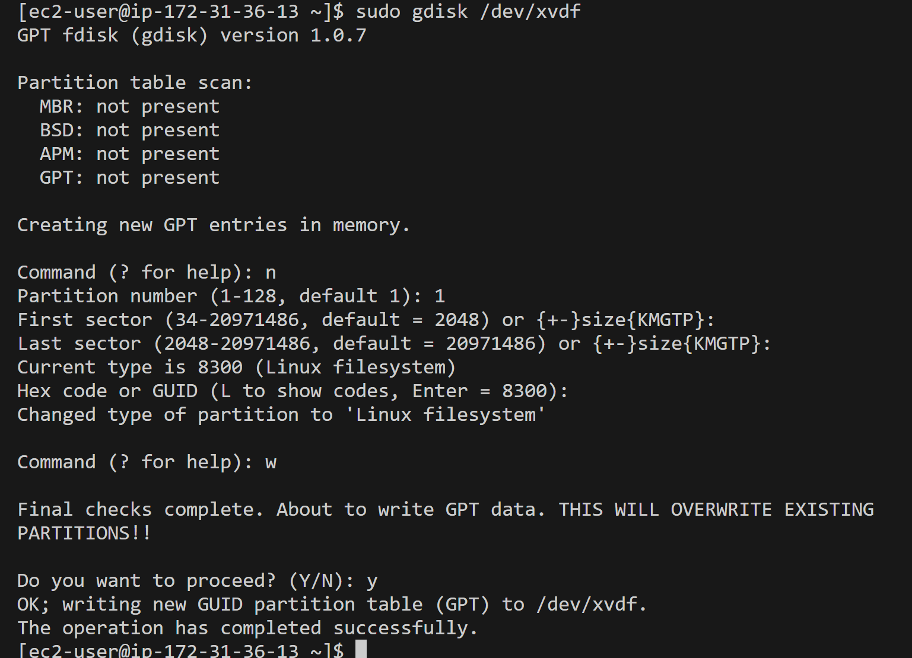

Use `lsblk` to view the configured partitions.

>       sudo lsblk

Run the command below to install the LVM2 Package and check for available partitions

>       sudo yum install lvm2

>       sudo lvmdiskscan

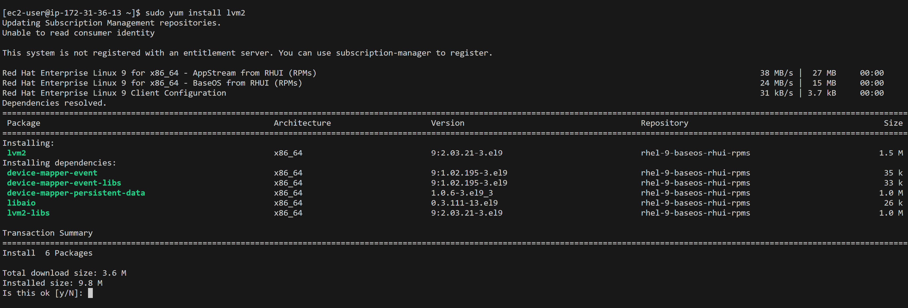

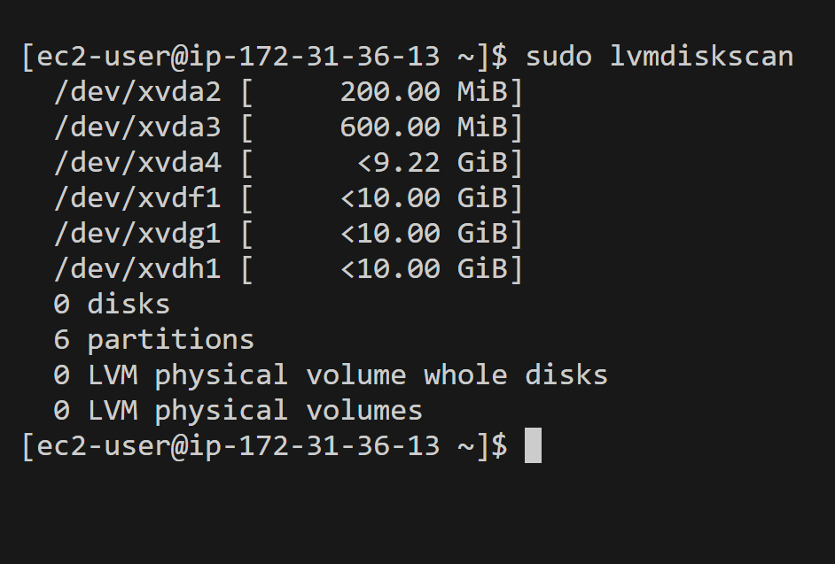

Mark each of the 3 disks as Physical Volume (PV) to be used by LVM (Logical Volume Management) and check if it has been created successfully by running the below commands:

>       sudo pvcreate /dev/xvdf1
>       sudo pvcreate /dev/xvdg1
>       sudo pvcreate /dev/xvdh1

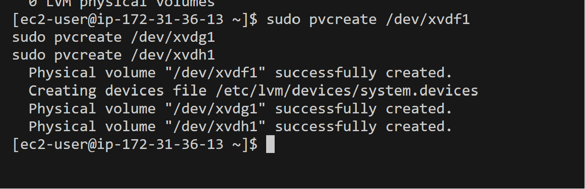

Check that the physical volumes are created

>       sudo pvs

Use  the `vgcreate` utility below to add all 3 VPs to a volume group (VG). I gave it a name nfsdata-vg and check if it successed with sudo lvs

>       sudo vgcreate nfsdata-vg /dev/xvdh1 /dev/xvdg1 /dev/xvdf1

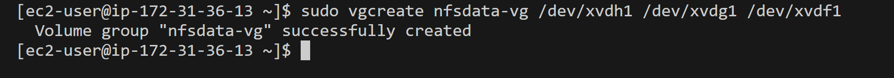

Create 3 Logical Volumes using `lvcreate`utility
        lv-opt,lv-apps,and lv-logs

>       sudo lvcreate -n lv-apps -L 9G nfsdata-vg
>       sudo lvcreate -n lv-logs -L 9G nfsdata-vg
>       sudo lvcreate -n lv-opt -L 9G nfsdata-vg

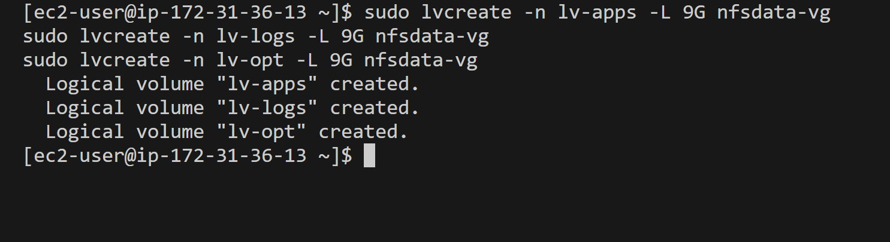

and 

>       sudo lvs
To check if the logical volumes have been created

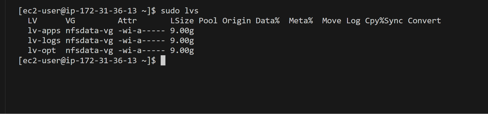

Verify the entire setup
>       sudo vgdisplay -v #view complete setup - VG, PV, and LV

Use mkfs.xfs to format the logical volumes with xfs filesystem
Instead of formating the disks as ext4 you will have to format them as xfs

>       sudo mkfs -t xfs /dev/nfsdata-vg/lv-apps
>       sudo mkfs -t xfs /dev/nfsdata-vg/lv-logs
>       sudo mkfs -t xfs /dev/nfsdata-vg/lv-opt

 
Create mount points on /mnt directory for the logical volumes as follow:
    Mount lv-apps on /mnt/apps – To be used by webservers

    Mount lv-logs on /mnt/logs – To be used by webserver logs

    Mount lv-opt on /mnt/opt – 

Create /mnt/apps directory to store website files

>       sudo mkdir -p /mnt/apps 
>       sudo mkdir -p /mnt/logs 
>       sudo mkdir -p /mnt/opt

Mount on all three LV

Mount /mnt/apps on lv-apps logical volume

>       sudo mount /dev/nfsdata-vg/lv-apps /mnt/apps 

Use rsync utility to back up all the files in the log directory /var/log into /mnt/logs (This is required before mounting the file system)

>       sudo rsync -av /mnt/logs/. /var/log

Mount /mnt/log on lv-logs logical volume. (Note that all the existing data on /mnt/log will be deleted.)
>       sudo mount /dev/nfsdata-vg/lv-logs /mnt/logs

Restore log files back into /mnt/log directory

>       sudo rsync -av /mnt/logs/. /var/log

>       sudo mount /dev/nfsdata-vg/lv-opt /mnt/opt

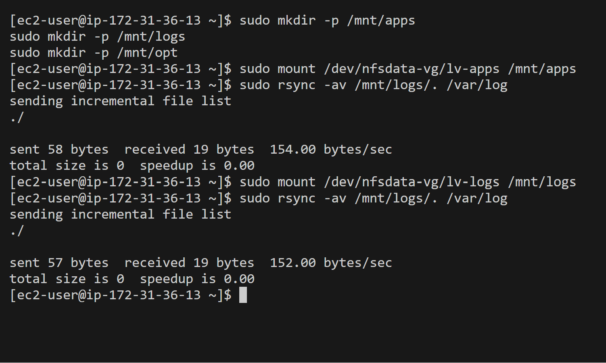

3. 
Open the /etc/fstab file in text editor with the command below

>       sudo blkid 

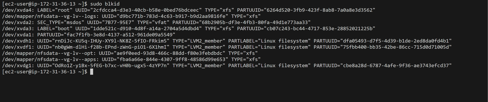

Then update /etc/fstab in this format using your own app and log UUID and rememeber to remove the leading and ending quotes.

>       sudo vi /etc/fstab

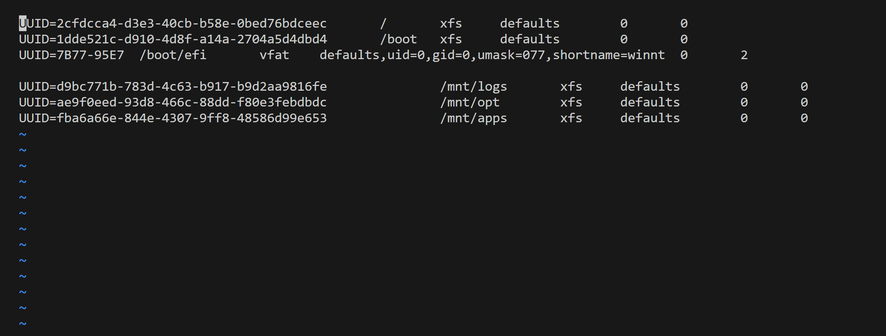

Test the configuration and reload the daemon
>       sudo mount -a
>       sudo systemctl daemon-reload

4. 
Install NFS server, configure it to start on reboot and make sure it is up and running

>       sudo yum update -y 
>       sudo yum install nfs-utils -y
>       sudo systemctl start nfs-server.service
>       sudo systemctl enable nfs-server.service
>       sudo systemctl status nfs-server.service

5. 
Export the mounts for webservers’ subnet CIDR to connect as clients.
For simplicity, install all three Web Servers inside the same subnet, but in the production set-up, you would probably want to separate each tier inside its own subnet for a higher level of security.
To check your subnet cidr – open your EC2 details in the AWS web console and locate the ‘Networking’ tab and open a Subnet link

Make sure we set up permission that will allow our Web servers to read, write and execute files on NFS:

>       sudo chown -R nobody: /mnt/apps
>       sudo chown -R nobody: /mnt/logs
>       sudo chown -R nobody: /mnt/opt

>       sudo chmod -R 777 /mnt/apps
>       sudo chmod -R 777 /mnt/logs
>       sudo chmod -R 777 /mnt/opt

>       sudo systemctl restart nfs-server.service

Configure access to NFS for clients within the same subnet (example of Subnet CIDR – 172.31.80.0/20):

>       sudo vi /etc/exports

>       /mnt/apps <Subnet-CIDR>(rw,sync,no_all_squash,no_root_squash)
>       /mnt/logs <Subnet-CIDR>(rw,sync,no_all_squash,no_root_squash)
>       /mnt/opt <Subnet-CIDR>(rw,sync,no_all_squash,no_root_squash)

Copy and paste above command and input your `subnet-CIDR`

`Esc + :wq!`

>       sudo exportfs -arv

6. 
Check which port is used by NFS and open it using Security Groups (add new Inbound Rule)
>       rpcinfo -p | grep nfs

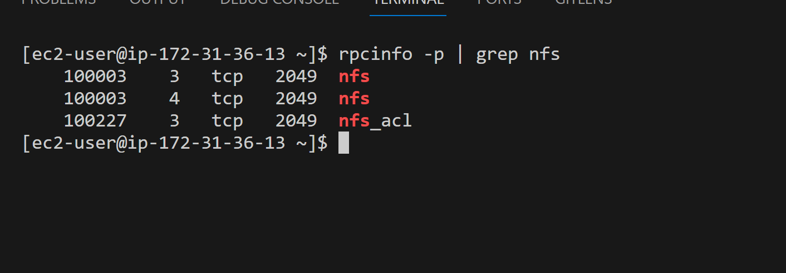

Important note: In order for NFS server to be accessible from your client, you must also open following ports:
`TCP 111, UDP 111, UDP 2049,TCP 2049`

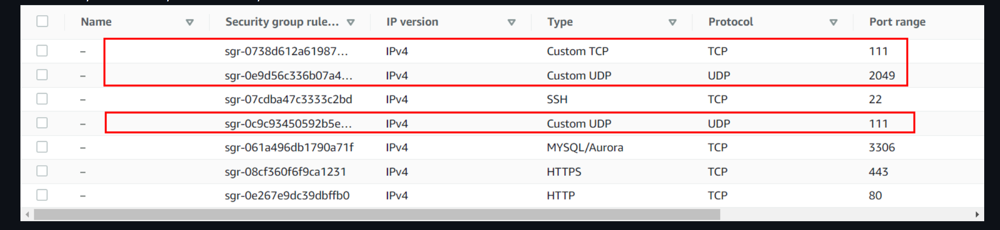

#### Step 2

## Configure the Database Server

***Install and configure a MySQL DBMS to work with remote Web Server***

Update ubuntu
>       sudo apt update

 
Upgrade ubuntu
>       sudo apt upgrade -y

Install MySQL Server
>       sudo apt install mysql-server -y

Start server and Check the status to ensure it is running
>       sudo systemctl enable mysql
>       sudo systemctl status mysql

First, open up the MySQL prompt

>       sudo mysql

Create database and name it tooling
Create User with the SQL query
Grant Privileges to User and flush privileges

#### Step 3 

## Prepare the Web Servers

We need to make sure that our Web Servers can serve the same content from shared storage solutions, in our case – NFS Server and MySQL database.

You already know that one DB can be accessed for reads and writes by multiple clients. For storing shared files that our Web Servers will use – we will utilize NFS and mount previously created Logical Volume lv-apps to the folder where Apache stores files to be served to the users (/var/www).

This approach will make our Web Servers stateless, which means we will be able to add new ones or remove them whenever we need, and the integrity of the data (in the database and on NFS) will be preserved.

During the next steps we will do following:

- Configure NFS client (this step must be done on all three servers)

- Deploy a Tooling application to our Web Servers into a shared NFS folder

- Configure the Web Servers to work with a single MySQL database

1. Launch a new EC2 instance with RHEL 8 Operating System
2. Install NFS client

>       sudo yum install nfs-utils nfs4-acl-tools -y

3. Mount `/var/www/` and target the NFS server’s export for apps

>       sudo mkdir /var/www
>       sudo mount -t nfs -o rw,nosuid <NFS-Server-Private-IP-Address>:/mnt/apps /var/www

4. Verify that NFS was mounted successfully by running `df -h`.

Make sure that the changes will persist on Web Server after reboot
>       sudo vi /etc/fstab

Add following line

<NFS-Server-Private-IP-Address>:/mnt/apps /var/www nfs defaults 0 0

5. Install Remi’s repository, Apache and PHP

>       sudo yum install httpd -y
>       sudo dnf install https://dl.fedoraproject.org/pub/epel/epel-release-latest-8.noarch.rpm
>       sudo dnf install dnf-utils http://rpms.remirepo.net/enterprise/remi-release-8.rpm
>       sudo dnf module reset php
>       sudo dnf module enable php:remi-7.4
>       sudo dnf install php php-opcache php-gd php-curl php-mysqlnd
>       sudo systemctl start php-fpm
>       sudo systemctl enable php-fpm
>       sudo setsebool -P httpd_execmem 1

**Repeat steps 1-5 for the other 2 Web Servers.**

6. Verify that Apache files and directories are available on the Web Server in /var/www and also on the NFS server in /mnt/apps.
If you see the same files – it means NFS is mounted correctly. You can try to create a new file touch test.txt in the /var/www path from one server and check if the same file is accessible from other Web Servers.
Note in the images below: 
The `text.md` file created in the `Webserver` showed as well in the `nfs-server`  

7. Locate the log folder for Apache on the Web Server and mount it to NFS server’s export for logs. Repeat step №3 to make sure the mount point will persist after reboot.

>      sudo mount -t nfs -o rw,nosuid <NFS-Server-Private-IP-Address>:/mnt/apps /var/www

8. Fork the tooling source code from [darey.io](https://github.com/darey-io/tooling)

Install git and clone

>       sudo yum install git

>       git init 

>       git clone https://github.com/darey-io/tooling

9. Deploy the tooling website’s code to the Webserver. Ensure that the html folder from the repository is deployed to `/var/www/html`

>       cd tooling 
>       sudo cp -R html/. /var/www/html

Note 1: Do not forget to open TCP port 80 on the Web Server.
Note 2: If you encounter 403 Error – check permissions to your /var/www/html folder and also disable SELinux

To make this change permanent – open following config file

>       sudo vi /etc/sysconfig/selinux
and set SELINUX=disabled then restart httpd.

>       sudo systemctl restart httpd
>       sudo systemctl status httpd

10. cd into the location of the tooling folder in the server, update the website's configuration to connect to the database in sudo vi /var/www/html/functions.php and edit, use the database private IP address.

>       sudo vi /var/www/html/functions.php

11. On the Webserver first, install MySQL 
>       sudo yum install mysql -y 

then run the following, using database private IP

If you can't connect to it and there is an error simply move to the DB server to edit the inbound security group.
Then edit the mysqld.cnf file

>       sudo vi /etc/mysql/mysql.conf.d//mysqld.cnf

>       sudo systemctl restart mysql

>       sudo systemctl status mysql

12. Create in MySQL a new admin user with username: myuser and password: password:

INSERT INTO 'users' ('id', 'username', 'password', 'email', 'user_type', 'status') VALUES
-> (1, 'myuser', '5f4dcc3b5aa765d61d8327deb882cf99', 'user@mail.com', 'admin', '1');

13. Copy the webserver's public IP into the browser which is followed by /index.php and log in to the website with the user. Then unencrypt the password.

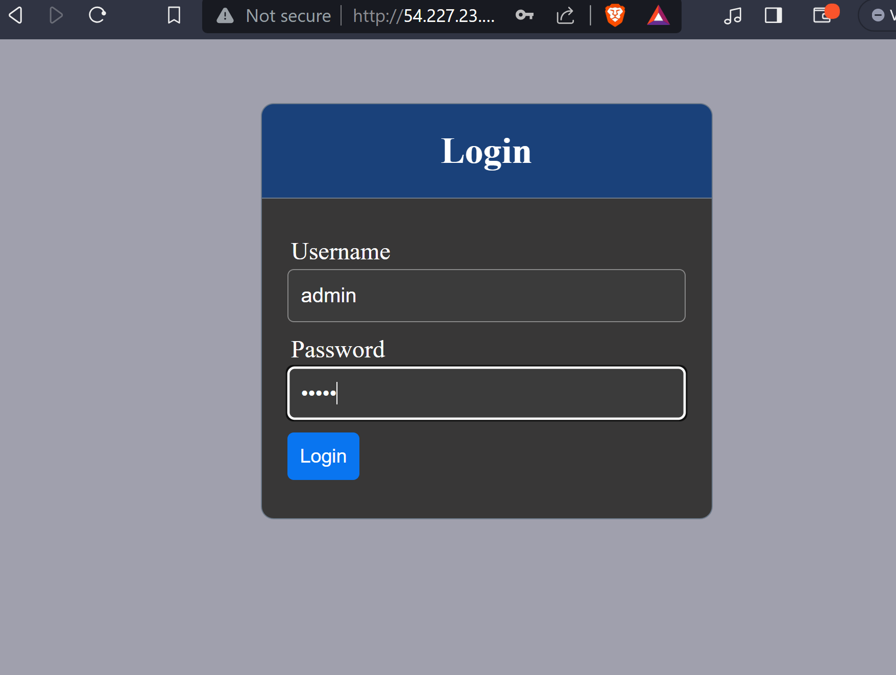
 login with the unecrypted password. And you should have the below page open

 

 

 # That was a long Project!

