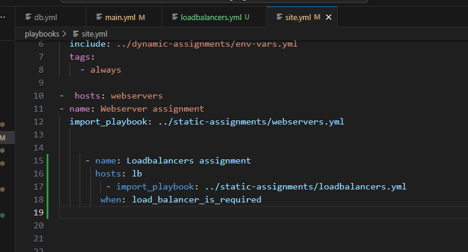
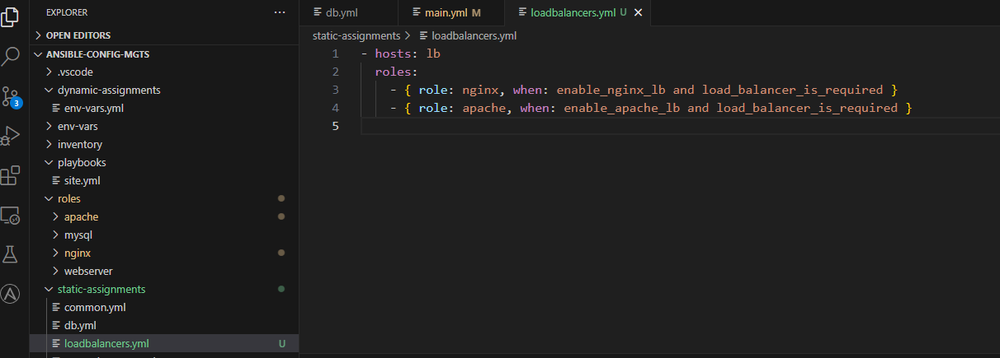
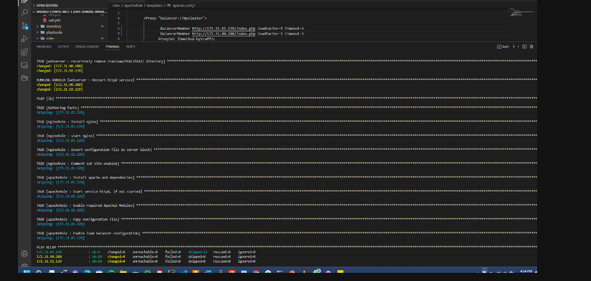

# Ansible Dynamic Assignments (Include) and Community Roles

In this project we will introduce dynamic assignments by using include module.

Static assignments use import Ansible module. The module that enables dynamic assignments is include.

>           Import = Static

>           Include = Dynamic    

Include does similar thing as Imports but differs because it is dynamic. Dynamic in the sense that ansible is able pick changes in playbooks added to a master playbook in real time. In import ansible preprocesses everything runs the playbook with the data it has. Changes made while executing the playbook is ignored.

Take note that in most cases it is recommended to use static assignments for playbooks, because it is more reliable. With dynamic ones, it is hard to debug playbook problems due to its dynamic nature. However, you can use dynamic assignments for environment specific variables as we will be introducing in this project.

## Introducing Dynamic Assignment Into Our structure

In your https://github.com//ansible-config-mgts GitHub repository start a new branch and call it `dynamic-assignments`.

Then inside this folder, create a new file and 
name it `env-vars.yml`. We will instruct `site.yml` to include this playbook later.

Since we will be using the same Ansible to configure multiple environments, and each of these environments will have certain unique attributes, such as servername, ip-address etc., we will need a way to set values to variables per specific environment.

Your GitHub shall have following structure by now.

    ├── dynamic-assignments
    │   └── env-vars.yml
    ├── inventory
    │   └── dev
        └── stage
        └── uat
        └── prod
    └── playbooks
        └── site.yml
    └── roles (optional folder)
        	└──...(optional subfolders & files)
    └── static-assignments
        └── common.yml

For this reason, we will now create a folder to keep each environment’s variables file. Therefore, create a new folder `env-vars`, then for each environment, create new YAML files which we will use to set variables.

Your layout should now look like this.

        ├── dynamic-assignments
        │   └── env-vars.yml
        ├── env-vars
            └── dev.yml
            └── stage.yml
            └── uat.yml
            └── prod.yml
        ├── inventory
            └── dev
            └── stage
            └── uat
            └── prod
        ├── playbooks
            └── site.yml
        └── static-assignments
            └── common.yml
            └── uat webservers.yml

            

Now paste the instruction below into the `env-vars.yml` file.

    ---
    - name: collate variables from env specific file, if it exists
    hosts: all
    tasks:
        - name: looping through list of available files
        include_vars: "{{ item }}"
        with_first_found:
            - files:
                - dev.yml
                - stage.yml
                - prod.yml
                - uat.yml
            paths:
                - "{{ playbook_dir }}/../env-vars"
        tags:
            - always

3 things to notice here:

1. We used `include_vars` syntax instead of `include`, this is because Ansible developers decided to separate different features of the module. From Ansible version 2.8, the `include` module is deprecated and variants of `include_*` must be used. These are:

 - include_role  
 - include_tasks  
 - include_vars

We made use of a special variables {{ playbook_dir }} and {{ inventory_file }}. The {{ playbook_dir }} will help Ansible to determine the location of the running playbook, and from there navigate to other path on the filesystem. While {{ inventory_file }} on the other hand will dynamically resolve to the name of the inventory file being used, then append .yml so that it picks up the required file within the env-vars folder. We are including the variables using a loop. with_first_found implies that, looping through the list of files, the first one found is used. This is good so that we can always set default values in case an environment specific env file does not exist.

## UPDATE SITE.YML WITH DYNAMIC ASSIGNMENTS

Update `site.yml` with `dynamic assignments`

Update site.yml file to make use of the dynamic assignment. (At this point, we cannot test it yet. We are just setting the stage for what is yet to come. So hang on to your hats)

`site.yml` should now look like this.

    ---
    - name: Include dynamic variables 
    hosts: all
    tasks:
        - import_playbook: ../static-assignments/common.yml 
        - include_playbook: ../dynamic-assignments/env-vars.yml
    tags:
        - always

    - name: uat-Webserver assignment
    hosts: webservers
        - import_playbook: ../static-assignments/webservers.yml

### Community Roles

Now it is time to create a role for `MySQL database` – it should install the `MySQL package`, create a database and configure users. But why should we re-invent the wheel? There are tons of roles that have already been developed by other open source engineers out there. These roles are actually production ready, and dynamic to accomodate most of Linux flavours. With `Ansible Galaxy` again, we can simply download a ready to use ansible role, and keep going.

***Download Mysql Ansible Role***

We will be using a MySQL role developed by geerlingguy

Hint: To preserve your your GitHub in actual state after you install a new role - make a commit and push to master your ‘ansible-config-mgt’ directory. Of course you must have git installed and configured on Jenkins-Ansible server and, for more convenient work with codes, you can configure Visual Studio Code to work with this directory. In this case, you will no longer need webhook and Jenkins jobs to update your codes on Jenkins-Ansible server, so you can disable it - we will be using Jenkins later for a better purpose.

On Jenkins-Ansible server make sure that git is installed with git --version, then go to ‘ansible-config-mgt’ directory and run

>       git init
>       git pull https://github.com/<your-name>/ansible-config-mgt.git
>       git remote add origin https://github.com/<your-name>/ansible-config-mgt.git
>       git branch new-features
>       git switch new-features

Inside roles directory create your new MySQL role with `ansible-galaxy install geerlingguy.mysql -p` . and rename the folder to `mysql`

>           mv geerlingguy.mysql/ mysql]

Read README.md file, and edit roles configuration to use correct credentials for `MySQL` required for the tooling website.

Now it is time to upload the changes into your GitHub repo:

>           git add .
>           git commit -m "Commit new role files into GitHub"
>           git push --set-upstream origin roles-feature

Now, if you are satisfied with your codes, you can create a Pull Request and merge it to main branch on GitHub.

### Role for Load Balancer
We want to be able to choose which Load Balancer to use, `Nginx` or `Apache`, so we need to have two roles respectively:

Nginx

Apache

Decide if you want to develop your own roles (apache), or find available ones from the community(nginx).

I chose the following:

For the nginx role. you can clone the work 
>           ansible-galaxy role install mullholland.nginx

For the apache role. you can clone the work 

>           ansible-galaxy role install shaneholloman.apache

Important Hints:
1. Since you cannot use both `Nginx` and `Apache load balancer`, you need to add a condition to enable either one – this is where you can make use of variables.

2. Declare a variable in defaults/main.yml file inside the Nginx and Apache roles. Name each variables enable_nginx_lb and enable_apache_lb respectively.

3. Set both values to false like this enable_nginx_lb: false and enable_apache_lb: false.

4. Declare another variable in both roles load_balancer_is_required and set its value to false as well

5. Update both assignment and site.yml files respectively

Update both static-assignment and site.yml files to refer the roles Important Hints: Since you cannot use both Nginx and Apache load balancer, you need to add a condition to enable either one - this is where you can make use of variables.

Declare a variable in defaults/main.yml file inside the Nginx and Apache roles. Name each variables enable_nginx_lb and enable_apache_lb respectively.

Set both values to false like this: enable_nginx_lb: false enable_apache_lb: false.

Declare another variable in both roles load_balancer_is_required and set its value to false as well Update both assignment and site.yml files respectively loadbalancers.yml file

`loadbalancers.yml` file

    - hosts: lb
    roles:
        - { role: nginx, when: enable_nginx_lb and load_balancer_is_required }
        - { role: apache, when: enable_apache_lb and load_balancer_is_required }

        

`site.yml` file

     - name: Loadbalancers assignment
       hosts: lb
         - import_playbook: ../static-assignments/loadbalancers.yml
        when: load_balancer_is_required

 

Now you can make use of env-vars\uat.yml file to define which loadbalancer to use in UAT environment by setting respective environmental variable to true. We'll activate load balancer, and enable nginx by setting these in the respective environment’s env-vars file.

enable_nginx_lb: true load_balancer_is_required: true The same must work with apache LB, so we can switch it by setting respective environmental variable to true and other to false.

To test this, you can update inventory for each environment and run Ansible against each environment.

>            ansible-playbook -i /home/ubuntu/ansible-artifact/inventory/dev /home/ubuntu/ansible-artifact/playbooks/site.yml

