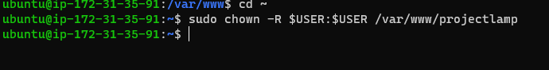
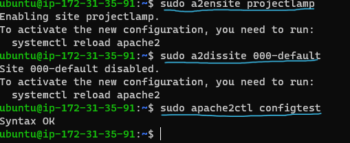

# LAMP STACK IMPLEMENTATION PROJECT

## Web Stack Implementation(Lamp Stack)in AWS

There are different stack of technologies that makes different solutions possible to a DevOps Engineer.

These stack of technologies are regarded as **WEB STACKS**. Which includes
- LAMP (Linux, Apache, MySQL, PHP or Python,or Perl)
- LEMP (Linux, Nginx, MySQL, PHP or Python, or Perl)
- MERN (MongoDB, ExpressJS, ReactJS, NodeJS)
- MEAN (MongoDB, ExpressJS, AngularJS, NodeJS)

These are sets of frameworks and tools used to develop a software. They are specifically grouped to work together in creating a well-functioning software.

## PREREQUISITES 

An AWS Account is very vital to have, it is where you will create an Ubuntu server. While creating the server, ensure you create a Pem Key pair and download it as this will be used to connect to the EC2 instance launched.

Then follow the steps below;

- Dowload your windows terminal via this link [WINDOWS TERMINAL](https://apps.microsoft.com/detail/9N0DX20HK701?activetab=pivot%3Aoverviewtab&hl=en-us&gl=US)
- On the Terminal, type the command cd downloads (or the folder you saved the .pem) to navigate to your download folder. 
- Your downloaded Key pair will be seated in downloads (or any folder you so choose).
When you are in the downloads folder, run the below command to connect to your EC2 instance successfully.

> cd ~/Downloads
> 

And your Ubuntu server is launched

### Step 1
## Installing Apache and Updating the Firewall

Apache HTTP Server is the most widely used web server software developed by Apache Software foundation. It is an open source software available for free that runs on 67% of all webservers in the world. It is fast, reliable, secure and can be highly customized to meet the needs of different environments by using extensions and modules. Most Wordpress hosting providers use this software as well as other softwares like Nginx, Microsoft IIS etc.

Steps to install Apache;

1- Run the commands below to update the list of packages in the package manager and the second command is to run the Apache2 package installer.

> $ sudo apt update
>
> 
> 
> 
> 
> $ sudo apt install apache2
>
> After running the code above, you then run this next one to verify that you have correctly insytalled Apache2. If it is green and running, then you have just launched your first Web Server in the cloud. 
>
> > $ sudo systemctl status apache2
>
> 

Open port 80 which is the default port that web servers use to access web pages on the internet. This should be done on the AWS console where the SSH port was enabled.
Then Run the below commands to test how the Apache server responds to curl with some payload after the HTTP port is configured running the below commands. The first command is trying to access the webserver via a DNS name while the second by IPs address(the Ip specified, corresponds to the DNS name 'localhost' and the process of converting the DNS name to Ip is called resolution).

> $ curl http://localhost:80
> 
or

> $ curl http://127.0.0.1:80
>
> 
>
>Once you get a positive response,try accessing Apache from your browser via this address https://<Public Ip address>:80 
> This is the page you should see and it is the same content as seen in the curl local host command ran just that on the web, the HTML formatting is represented well.
>
> 

### Step 2
## Installing MySQL

The next step is to install a Database Management System for storage and management of the data on your site in a relational database and MySQL is the popular one used with PHP environments.

To install MySQL:

Run the command below to install MySQL software and when prompted to confirm installation, type Y.

> sudo apt install mysql-server
>
> 
>
> Login to the MySQL console with the code below and this will connect to the MySQL server as the administrative database User root which is inferred by the use of sudo when running the command.

You are advised to run a security script that comes pre-installed with MySQL. This script will remove some insecure default settings and lock down access to your database system. before running the script, you will set a password for the root User, using **mysql_native _password** as default authentication method. We are defining this user's password here as **Password.1**

> ALTER USER 'root'@'localhost' IDENTIFIED WITH mysql_native_password BY 'PassWord.1';
>
> Exit the MySQL shell with
>
> 
>
> > mysql> exit

Start the interactive script by running the:

> $ sudo mysql_secure_installation
>
> This will ask you if you want to configure the `VALIDATE PASSWORD PLUGIN `(note that enabling this feature is a judgement call, and if enabled, passwords which do not match the specified criteria will be rejected by MySQL with an error), so it is safe to leave it as disabled but use strong and unique passwords.
> After you answer yes, you will need to select a level of password verification (selecting 2 means strongest level as you will get errors when password does not contain numbers, upper and lowercases letters, and special characters).
>
>Please note that this password asked is the ***MySQL root user*** as the frst password set is the ***database root User password***. You will be shown the password strength that you just entered if password validation is enabled and you satisfied with the password enter Y for yes at the prompt.

For the rest of questions press Y and hit Enter at each prompt.This will prompt you to change root password, remove some anonymous users and test database, disable remote root logins and load these new rules so that MySQL immediately respects the changes made.

When finished, test if login is successful running the below command. The -p flag will prompt for password used after changing the root user password

> sudo mysql -p
> 
> 
>
> You can then log out with the command
> 

### Step 3
## Installing PHP

PHP is the conmponent of our setup that will help process code to display dynamic content to the end user. In addition to the *php* package, the *php-mysql* module that allows PHP to comummunicate with MySQL-based databases is needed. There also need for *libapache2-mod-php* to enable Apache handle PHP files. The Core PHP packages will be installed as dependencies.

To install the 3 packages at once. Run the following code:

> sudo apt install php libapache2-mod-php php-mysql
>
> 

Once the installation is complete, run the below command to confirm PHP version.

> php -v
> 
>
>At this point the LAMP stack (Linux, Apache, MySQL and PHP) is completely installed and fully operational.

### Step 4
## Creating a Virtual Host for your Website using Apache

Set up a domain called ***projectlamp*** . Apache on Ubuntu has a server block enabled by default that is configured to serve documents from the **/var/www/html** directory and we will be leaving this confirguration as it is and create another directory next to the default one.

Create directory for ***projectlamp*** runing the command below:

> $ sudo mkdir /var/www/projectlamp
>
> 
>
> Assign ownership of the directory with the &USER environment variable, which will reference the current system user.

> $ sudo chown -R $USER:$USER /var/www/projectlamp
>
> 
>
> Create and open a new configuration file in Apache's sites-available directory using any command line editor.
>
> $ sudo vi /etc/apache2/sites-available/projectlamp.conf
>
> 
>
> Paste the below bare-bones configuration by hitting on *i* on the keyboard to enter insert mode and paste the below
>
<VirtualHost *:80>
    ServerName projectlamp
    ServerAlias www.projectlamp 
    ServerAdmin webmaster@localhost
    DocumentRoot /var/www/projectlamp
    ErrorLog ${APACHE_LOG_DIR}/error.log
    CustomLog ${APACHE_LOG_DIR}/access.log combined
</VirtualHost>
 Once you save and close, run the code below and you will get the result in the image

 >sudo ls /etc/apache2/sites-available

   

With this configuration, we are telling Apache to serve ***projectlamp*** using **/var/www/projectlamp** as its root directory. If you want the Apache server to test without Domain name, /comment the options serverName and Server Alias by adding # in the beginning of each option's lines to tell the program to skip processing those lines.

You can use a2ensite to enable the new virtual host.
> $ sudo a2ensite projectlamp

You might want to disable the default website that comes installed with apache running the below command.
> $ sudo a2dissite 000-default
>
> To make sure your configuration does not containsyntax error, run.
> >$ sudo apache2ctl configtest
>
> 

Reload Apache so the changes take effect

> $ sudo systemctl reload apache2
> 

Your new website is now active but ***/var/www/projectlamp*** is still empty. Create an **index.html** file in that location so that you can test the Virtual host works as expected.

> sudo echo 'Hello LAMP from hostname' $(curl -s http://169.254.169.254/latest/meta-data/public-hostname) 'with public IP' $(curl -s http://169.254.169.254/latest/meta-data/public-ipv4) > /var/www/projectlamp/index.html
>
> Access the website from the browser
> http://<Public-IP-Address>:80

If you see the text from the 'echo' command written to the html file, then the Virtual Host is working well. You should see your server's public hostname(DNS name) and Public Ip address. You can also access Website on your browser by public DMS name.

END.

### Step 5
## Enable PHP on the website

With the default **DirectoryIndex**, settings on Apache, a file named ***index.html*** will always take precedence over an ***index.php*** file. This is useful for setting up maintenance pages in PHP application, by creating a temporary ***index.html*** which will give a temporary landing page for the application file containing an informative message to visitors.

Once maintenance is over, the ***index.html*** is renamed or removed from the document root, bringing back the regular application page.
To change this, you will need to edit the ***/etc/apache2/mods-enabled/dir.conf*** file and change the order in which the index.php file is listed within the **Directoryindex** directive.

> sudo vim /etc/apache2/mods-enabled/dir.conf
>
> This will open a text editor
>
> 
>
> 

After saving and closing the file, reload Apache so the changes can take effect running the below command.

> sudo systemctl reload apache2
>
> 

Finally we will create a PHP script to confirm that Apache is able to handle and process requests for PHP files.
Create a new file named ***index.php*** inside the custom web root folder.

> sudo vim /var/www/projectlamp/index.php
>
> This will open a blank editor. Add the following text, which is a valid PHP code inside the file.
>
<  <?php

   phpinfo();>

> 
>
> This output should be seen after you saved and close the file and refresh the page
>
> 
>
> After confirmation, it is safe to remove the file as it contains sensitive information about your PHP environment and Ubuntu Server running the below command.

