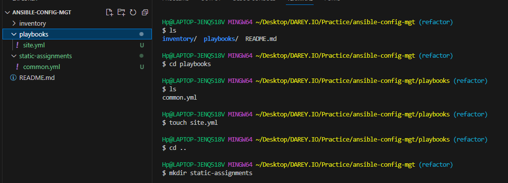
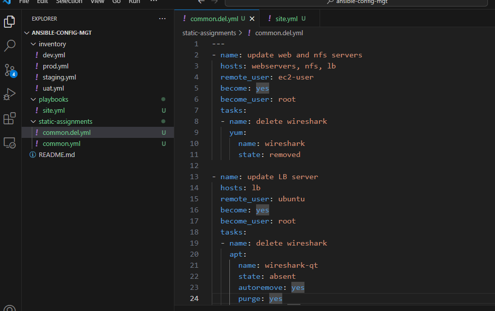
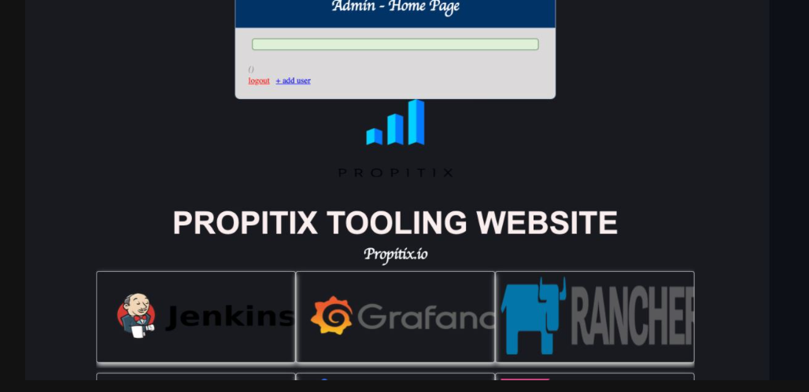
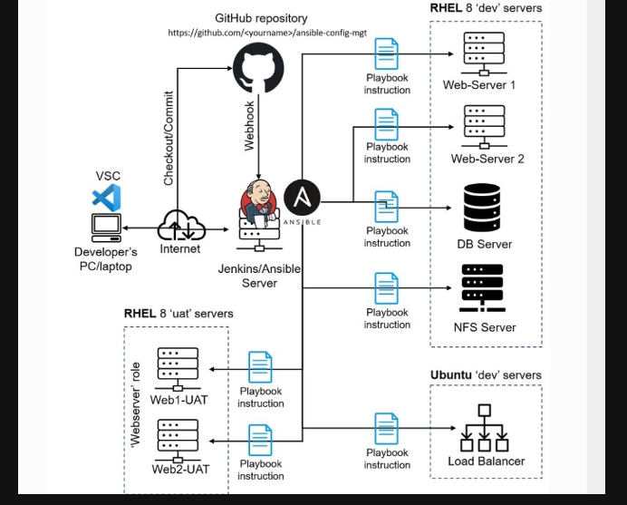

# ANSIBLE REFACTORING.ASSIGNMENTS & IMPORTS

In this project, I will continue working with `ànsible-config-mgt` repository and make some improvements of our code. We will refactor our Ansible code, create assignments, and learn how to use the import functionality. Imports allow to effectively re-use previously created playbooks in a new playbook - it allows us to organize our tasks and reuse them when needed.

#### Step 1 

##  Jenkins Job Enhancement
Before we begin, let us make some changes to our Jenkins job - now every new change in the codes creates a separate directory which is not very convenient when we want to run some commands from one place. Besides, it consumes space on Jenkins serves with each subsequent change. Let us enhance it by introducing a new Jenkins project/job - we will require Copy Artifact plugin.

1. Go to the Jenkins-ansible server and in the home directory of the ubuntu user, create a new directory named `ansible-config-mgt`

>           sudo mkdir /home/ubuntu/ansible-config-artifact

2. Change permissions to this directory, so Jenkins could save files there -
>           chmod -R 0777 /home/ubuntu/ansible-config-artifact

3.  Go to Jenkins web console -> Manage Jenkins -> Manage Plugins -> on `Available` tab search for `Copy Artifact` and install this plugin without restarting Jenkins

4. Create a new Freestyle project and name it `save_artifacts`. This project will be triggered by completion of your existing ansible project. Configure it accordingly:

5. This will be triggered on the successful build of your existing `ansible` job. Configure accordingly:

Note: You can configure number of builds to keep in order to save space on the server, for example, you might want to keep only last 2 or 5 build results. You can also make this change to your ansible job.

6. The main idea of `save_artifact` project is to save artifacts into `/home/ubuntu/ansible-config-artifact` directory. To achieve this, create a `Build` step and choose `Copy artifact from other project`, specify `ansible` as a source project and `/home/ubuntu/ansible-config-artifact` as a target directory.

7. Test your set up by making some change in `README.md` file inside your ansible-config-mgt repository (right inside main/master branch). If both Jenkins jobs have completed one after another - you shall see your files inside `/home/ubuntu/ansible-config-artifact directory` and it will be updated with every commit to your (main)master branch.

Note: Trigger Jenkins project execution only for /main (main) branch.

#### Step 2

## Refactor Ansible code by importing other playbooks into `site.yml`

Before starting to refactor any codes, ensure that you have pulled down the latest code from master (main) branch, and created a new branch, name it refactor.

#### Let see code re-use in action by importing other playbooks.

1. Within playbooks folder, create a new file and name it site.yml - This file will now be considered as an entry point into the entire infrastructure configuration. Other playbooks will be included here as a reference. In other words, site.yml will become a parent to all other playbooks that will be developed. Including common.yml that you created previously.

2. Create a new folder in root of the repository and name it static-assignments. The static-assignments folder is where all other children playbooks will be stored. This is merely for easy organization of your work.

3.  Move common.yml file into the newly created static-assignments folder.

4.  Inside site.yml file, import common.yml playbook.

>         - hosts: all
>         - import_playbook: ../static-assignments/common.yml

The code above uses built in import_playbook Ansible module.

The folder structure looks like this;

    ├── static-assignments
       └── common.yml
    ── inventory
       └── dev
       └── stage
       └── uat
       └── prod
    └── playbooks
       └── site.yml

5. Since you need to apply some tasks to your dev servers and wireshark is already installed – You can go ahead and create another playbook under static-assignments and name it common-del.yml. In this playbook, configure deletion of wireshark utility.

>   ---
>       - name: update web and nfs servers
>         hosts: webservers and nfs
>         remote_user: ec2-user
>         become: yes
>         become_user: root
>         tasks:
>         - name: delete wireshark
>           yum:
>             name: wireshark
>             state: removed
>
>       - name: update LB and DB servers
>         hosts: lb, db 
>         remote_user: ubuntu
>         become: yes
>         become_user: root
>         tasks:
>         - name: delete wireshark
>           apt:
>             name: wireshark-qt
>             state: absent
>             autoremove: yes   
>             purge: yes
 >            autoclean: yes

 

Update `site.yml` with `- import_playbook: ../static-assignments/common-del.yml` instead of `common.yml` and run it against `dev` servers:

SSH into the jenkins-ansible server and run the playbook and inventory file

To refresh your memmory on how to ssh into a server for playbooks. 
1. eval `ssh-agent -s`
2. ssh-add <private path to the .pem file>
3. ssh-add -l  
4. ssh -A ubuntu@publicIP

>       ansible-playbook -i /home/ubuntu/ansible-config-artifact/inventory/dev.yml /home/ubuntu/ansible-config-artifact/playbooks/site.yml 

#### Step 3 
## Configure UAT Webservers with a role ‘Webserver’

We now have our nice and clean dev environment, so let us put it aside and configure 2 new `Web Servers as uat1`. We could write tasks to configure Web Servers in the same playbook, but it would be too messy, instead, we will use a dedicated role to make our configuration reusable.

1.Launch 2 fresh EC2 instances using RHEL 8 image, we will use them as our uat servers, so give them names accordingly Web1-UAT and Web2-UAT. **Make sure the name of the serve the instance and the playbook are spelt same, or else it will be returning errors**

2. To create a role, you must create a directory called roles/, relative to the playbook file or in /etc/ansible/ directory

There are two ways how you can create this folder structure:

- Use an Ansible utility called `ansible-galaxy` inside ansible-config-mgt/roles directory (you need to create roles directory upfront)

>       mkdir roles

>       cd roles

>       ansible-galaxy init webserver

**Note**: You can choose either way, but since you store all your codes in GitHub, it is recommended to create folders and files there rather than locally on Jenkins-Ansible server.

The entire folder structure should look like below, but if you create it manually - you can skip creating `tests`, `files`, and `vars` or remove them if you used ansible-galaxy, because they are all automatically created.

    └── webserver
        ├── README.md
        ├── defaults
        │   └── main.yml
        ├── handlers
        │   └── main.yml
        ├── meta
        │   └── main.yml
        ├── tasks
        │   └── main.yml
        └── templates

Update your inventory `ansible-config-mgt/inventory/uat.yml` file with IP addresses of your 2 UAT Web servers:

>       [uat-webservers]
>       <Web1-UAT-Server-Private-IP-Address> >  >ansible_ssh_user='ec2-user' 
>
>       <Web2-UAT-Server-Private-IP-Address> ansible_ssh_user='ec2-user' 

3. In **/etc/ansible/ansible.cfg** file uncomment `roles_path` string and provide a full path to your roles directory `roles_path = /home/ubuntu/ansible-config-mgt/roles`, so Ansible could know where to find configured roles.

4. It is time to start adding some logic to the webserver role. Go into tasks directory, and within the `main.yml` file, start writing configuration tasks to do the following:

- Install and configure Apache (httpd service)
- Clone Tooling website from GitHub `https://github.com//tooling.git.`
- Ensure the tooling website code is deployed to `/var/www/html` on each of 2 UAT Web servers.
- Make sure `httpd` service is started

Your main.yml may consist of following tasks:

---
    - name: Install apache
      become: true
      ansible.builtin.yum:
        name: "httpd"
        state: present

    - name: Install git 
      become: true
      ansible.builtin.yum:
        name: "git"
        state: present

    - name: clone a repo
      become: true
      ansible.builtin.git:
        repo: https://github.com/Tonybesto/tooling.git
        dest: /var/www/html
        force: yes

    - name: copy html content to one level up
      become: true
      command: cp -r /var/www/html /var/www/

    - name: Start service httpd, if not started
      become: true
      ansible.builtin.service:
        name: httpd
        state: started

    - name: recursively remove /var/www/html directory
      become: true
      ansible.builtin.file:
      path: /var/www/html
      state: absent

#### Step 4 –
## Reference ‘Webserver’ role

Within the static-assignments folder, create a new assignment for uat-webservers uat-webservers.yml. This is where you will reference the role.

       ---
    - hosts: uat-webservers
      roles:
        - webserver

Remember that the entry point to our ansible configuration is the site.yml file. Therefore, you need to refer your uat-webservers.yml role inside site.yml.

So, we should have this in site.yml

>           ---
>           - hosts: all
>           - import_playbook: ../static-assignments/common.yml
>
>           - hosts: uat-webservers
>           - import_playbook: ../static-assignments/uat-webservers.yml

#### Step 5 – 
## Commit & Test
Commit your changes, create a Pull Request and merge them to main branch, make sure webhook triggered two consequent Jenkins jobs, they ran successfully and copied all the files to your Jenkins-Ansible server into `/home/ubuntu/ansible-config-mgt/` directory.

Now run the playbook against your `uat` inventory and see what happens:

>        ansible-playbook -i /home/ubuntu/ansible-config-mgt/inventory/uat.yml /home/ubuntu/ansible-config-mgt/playbooks/site.yaml

You should be able to see both of your UAT Web servers configured and you can try to reach them from your browser:

>           http://<Web1-UAT-Server-Public-IP-or-Public-DNS-Name>/index.php

>           or

>           http://<Web1-UAT-Server-Public-IP-or-Public-DNS-Name>/index.php

***You should be able to see both of your UAT Web servers configured and you can try to reach them from your browser***:

**Your ansible Architecture should look like this below**

